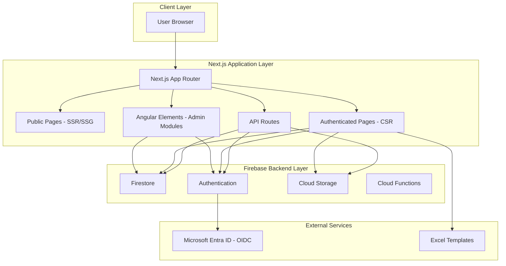

# Target Architecture Design

## Document Overview

**Design Date:** February 1, 2026  
**Target Stack:** Next.js 15+ + Angular Elements + Firebase  
**Architecture Pattern:** Hybrid Strangler Pattern with Micro-Frontends

---

## 1. Architecture Overview

### 1.1 High-Level Diagram



### 1.2 Architecture Principles

1. **Progressive Enhancement:** Core functionality works without JavaScript
2. **Performance First:** Server-side rendering for public pages, client-side for authenticated
3. **Incremental Migration:** Strangler pattern for gradual transition
4. **Micro-Frontends:** Angular Elements for complex admin modules
5. **Firebase-Native:** Leverage Firebase strengths (real-time, auth, storage)

---

## 2. Next.js Application Structure

### 2.1 Directory Layout

```
nextjs-app/
├── app/                          # Next.js App Router
│   ├── (auth)/                   # Authenticated route group
│   │   ├── layout.tsx           # Auth layout wrapper
│   │   ├── dashboard/
│   │   │   └── page.tsx        # Dashboard page
│   │   ├── reports/
│   │   │   ├── page.tsx        # Reports list
│   │   │   ├── [id]/
│   │   │   │   └── page.tsx    # Report detail
│   │   │   └── upload/
│   │   │       └── page.tsx    # Upload page
│   │   ├── financial/
│   │   │   ├── invoices/
│   │   │   ├── invoice-config/
│   │   │   └── income-expense/
│   │   ├── fleet/
│   │   │   ├── asset-register/
│   │   │   ├── logistics/
│   │   │   └── maintenance/
│   │   ├── ohs/
│   │   ├── personnel/
│   │   │   ├── leave-tracking/
│   │   │   └── onboarding/
│   │   └── supply-chain/
│   │       ├── material-master/
│   │       └── requisitions/
│   ├── (public)/                # Public route group
│   │   ├── layout.tsx
│   │   ├── page.tsx            # Landing page
│   │   ├── about/
│   │   └── contact/
│   ├── api/                     # API Routes
│   │   ├── auth/
│   │   │   └── [...nextauth]/
│   │   │       └── route.ts    # NextAuth.js configuration
│   │   ├── reports/
│   │   │   └── route.ts       # Report API proxy
│   │   ├── upload/
│   │   │   └── route.ts       # File upload handler
│   │   └── webhook/
│   │       └── route.ts       # Firebase webhooks
│   ├── layout.tsx              # Root layout
│   ├── page.tsx                # Home page
│   └── globals.css             # Global styles
├── components/                 # React components
│   ├── ui/                     # Base UI components (shadcn/ui)
│   │   ├── button.tsx
│   │   ├── input.tsx
│   │   ├── table.tsx
│   │   └── ...
│   ├── features/                # Feature-specific components
│   │   ├── reports/
│   │   │   ├── ReportCard.tsx
│   │   │   ├── ReportFilters.tsx
│   │   │   └── ReportTable.tsx
│   │   ├── upload/
│   │   │   ├── FileDropzone.tsx
│   │   │   ├── PreviewPanel.tsx
│   │   │   └── ValidationErrors.tsx
│   │   ├── financial/
│   │   ├── fleet/
│   │   ├── ohs/
│   │   ├── personnel/
│   │   └── supply-chain/
│   ├── layouts/                 # Layout components
│   │   ├── Navbar.tsx
│   │   ├── Sidebar.tsx
│   │   └── Footer.tsx
│   └── admin-elements/          # Angular Elements wrappers
│       ├── AdminDashboard.tsx
│       ├── AdvancedReports.tsx
│       └── DataManagement.tsx
├── lib/                        # Utility libraries
│   ├── firebase/               # Firebase client
│   │   ├── auth.ts
│   │   ├── firestore.ts
│   │   └── storage.ts
│   ├── excel/                  # Excel parsing
│   │   ├── parser.ts
│   │   ├── validators.ts
│   │   └── mappings.ts
│   ├── utils/                  # General utilities
│   │   ├── date.ts
│   │   ├── format.ts
│   │   └── validation.ts
│   └── hooks/                  # Custom React hooks
│       ├── useAuth.ts
│       ├── useFirestore.ts
│       ├── useReports.ts
│       └── useExcelUpload.ts
├── types/                      # TypeScript types
│   ├── report.ts
│   ├── discharge.ts
│   ├── financial.ts
│   └── index.ts
├── public/                     # Static assets
│   ├── angular-elements/        # Bundled Angular Elements
│   │   ├── admin-dashboard.js
│   │   ├── advanced-reports.js
│   │   └── data-management.js
│   └── images/
├── styles/                     # Additional styles
│   └── tailwind.css
├── middleware.ts               # Next.js middleware
├── next.config.js             # Next.js configuration
├── tailwind.config.ts         # Tailwind CSS configuration
├── tsconfig.json             # TypeScript configuration
└── package.json              # Dependencies
```

### 2.2 Route Structure

```typescript
// app/routes.ts (conceptual)
const routes = {
  // Public Routes (SSR/SSG)
  '/': 'Landing Page',
  '/about': 'About',
  '/contact': 'Contact',

  // Authenticated Routes (CSR)
  '/dashboard': 'Dashboard',
  '/reports': 'Reports List',
  '/reports/[id]': 'Report Detail',
  '/reports/upload': 'Upload Report',
  '/financial/invoices': 'Invoices',
  '/financial/invoice-config': 'Invoice Config',
  '/financial/income-expense': 'Income/Expense',
  '/fleet/asset-register': 'Asset Register',
  '/fleet/logistics': 'Logistics',
  '/fleet/maintenance': 'Maintenance',
  '/ohs': 'OHS Module',
  '/personnel/leave-tracking': 'Leave Tracking',
  '/personnel/onboarding': 'Onboarding',
  '/supply-chain/material-master': 'Material Master',
  '/supply-chain/requisitions': 'Requisitions',

  // API Routes
  '/api/auth/[...nextauth]': 'NextAuth.js',
  '/api/reports': 'Reports API',
  '/api/upload': 'File Upload',
  '/api/webhook': 'Firebase Webhooks',
};
```

---

## 3. Technology Stack

### 3.1 Core Technologies

| Technology | Version | Purpose |
|------------|----------|---------|
| Next.js | 15+ | React framework with SSR/SSG |
| React | 18+ | UI library |
| TypeScript | 5+ | Type safety |
| Tailwind CSS | 3.4+ | Styling |
| shadcn/ui | Latest | UI component library |

### 3.2 Firebase Integration

| Service | SDK | Purpose |
|---------|-----|---------|
| Firestore | firebase/firestore | Database |
| Authentication | firebase/auth | User authentication |
| Storage | firebase/storage | File storage |
| Functions | firebase/functions | Server-side logic |

### 3.3 Additional Libraries

| Library | Purpose |
|----------|---------|
| NextAuth.js | Authentication (OIDC with Microsoft Entra ID) |
| React Query / TanStack Query | Data fetching and caching |
| React Hook Form | Form handling |
| Zod | Schema validation |
| XLSX | Excel parsing (reuse) |
| Recharts | Data visualization |
| AG Grid React | Data grids |
| jsPDF | PDF generation (reuse) |
| file-saver | File downloads (reuse) |
| Zustand | State management |

### 3.4 Angular Elements

| Module | Purpose |
|--------|---------|
| Admin Dashboard | Complex admin interface |
| Advanced Reports | Advanced reporting tools |
| Data Management | Bulk data operations |

---

## 4. Firebase Integration Strategy

### 4.1 Firebase Client Initialization

```typescript
// lib/firebase/client.ts
import { initializeApp, getApps } from 'firebase/app';
import { getAuth } from 'firebase/auth';
import { getFirestore } from 'firebase/firestore';
import { getStorage } from 'firebase/storage';

const firebaseConfig = {
  apiKey: process.env.NEXT_PUBLIC_FIREBASE_API_KEY,
  authDomain: process.env.NEXT_PUBLIC_FIREBASE_AUTH_DOMAIN,
  projectId: process.env.NEXT_PUBLIC_FIREBASE_PROJECT_ID,
  storageBucket: process.env.NEXT_PUBLIC_FIREBASE_STORAGE_BUCKET,
  messagingSenderId: process.env.NEXT_PUBLIC_FIREBASE_MESSAGING_SENDER_ID,
  appId: process.env.NEXT_PUBLIC_FIREBASE_APP_ID,
};

// Initialize Firebase (singleton pattern)
const app = !getApps().length ? initializeApp(firebaseConfig) : getApps()[0];

export const auth = getAuth(app);
export const db = getFirestore(app);
export const storage = getStorage(app);
```

### 4.2 Authentication Flow

```typescript
// lib/auth/nextauth.ts
import NextAuth from 'next-auth';
import { CredentialsProvider } from 'next-auth/providers/credentials';
import { signInWithEmailAndPassword } from 'firebase/auth';
import { auth } from '@/lib/firebase/client';

export const { handlers, signIn, signOut, auth } = NextAuth({
  providers: [
    CredentialsProvider({
      name: 'Firebase',
      credentials: {
        email: { label: 'Email', type: 'email' },
        password: { label: 'Password', type: 'password' },
      },
      async authorize(credentials) {
        if (!credentials?.email || !credentials?.password) {
          return null;
        }

        try {
          const userCredential = await signInWithEmailAndPassword(
            auth,
            credentials.email,
            credentials.password
          );

          const user = userCredential.user;
          const idToken = await user.getIdToken();

          // Fetch user role from Firestore
          const userDoc = await getDoc(doc(db, 'users', user.uid));
          const userData = userDoc.data();

          return {
            id: user.uid,
            email: user.email,
            name: user.displayName,
            role: userData?.role || 'site_manager',
            idToken,
          };
        } catch (error) {
          console.error('Auth error:', error);
          return null;
        }
      },
    }),
  ],
  callbacks: {
    async jwt({ token, user }) {
      if (user) {
        token.uid = user.id;
        token.role = user.role;
        token.idToken = user.idToken;
      }
      return token;
    },
    async session({ session, token }) {
      session.user.id = token.uid;
      session.user.role = token.role;
      session.user.idToken = token.idToken;
      return session;
    },
  },
  pages: {
    signIn: '/login',
    error: '/login',
  },
  session: {
    strategy: 'jwt',
  },
});
```

### 4.3 Firestore Data Access Layer

```typescript
// lib/firestore/reports.ts
import {
  collection,
  doc,
  getDoc,
  getDocs,
  addDoc,
  updateDoc,
  query,
  where,
  orderBy,
  Timestamp,
} from 'firebase/firestore';
import { db } from '@/lib/firebase/client';
import type { Report } from '@/types/report';

export const reportsCollection = collection(db, 'reports');

export async function getReports(filters?: {
  siteId?: string;
  clientId?: string;
  status?: string;
  startDate?: Date;
  endDate?: Date;
}): Promise<Report[]> {
  let q = query(reportsCollection, orderBy('reportDate', 'desc'));

  if (filters?.siteId) {
    q = query(q, where('siteId', '==', filters.siteId));
  }
  if (filters?.clientId) {
    q = query(q, where('client', '==', filters.clientId));
  }
  if (filters?.status) {
    q = query(q, where('status', '==', filters.status));
  }
  if (filters?.startDate) {
    q = query(q, where('reportDate', '>=', Timestamp.fromDate(filters.startDate)));
  }
  if (filters?.endDate) {
    q = query(q, where('reportDate', '<=', Timestamp.fromDate(filters.endDate)));
  }

  const snapshot = await getDocs(q);
  return snapshot.docs.map(doc => ({
    id: doc.id,
    ...doc.data(),
    reportDate: doc.data().reportDate?.toDate() || new Date(),
    createdAt: doc.data().createdAt?.toDate() || new Date(),
    updatedAt: doc.data().updatedAt?.toDate() || new Date(),
  })) as Report[];
}

export async function getReport(reportId: string): Promise<Report | null> {
  const docRef = doc(db, 'reports', reportId);
  const docSnap = await getDoc(docRef);

  if (!docSnap.exists()) {
    return null;
  }

  const data = docSnap.data();
  return {
    id: docSnap.id,
    ...data,
    reportDate: data.reportDate?.toDate() || new Date(),
    createdAt: data.createdAt?.toDate() || new Date(),
    updatedAt: data.updatedAt?.toDate() || new Date(),
  } as Report;
}

export async function createReport(report: Omit<Report, 'id' | 'createdAt' | 'updatedAt'>): Promise<string> {
  const reportData = {
    ...report,
    reportDate: Timestamp.fromDate(report.reportDate),
    createdAt: Timestamp.now(),
    updatedAt: Timestamp.now(),
  };

  const docRef = await addDoc(reportsCollection, reportData);
  return docRef.id;
}

export async function updateReport(reportId: string, updates: Partial<Report>): Promise<void> {
  const docRef = doc(db, 'reports', reportId);
  await updateDoc(docRef, {
    ...updates,
    updatedAt: Timestamp.now(),
  });
}
```

---

## 5. Angular Elements Strategy

### 5.1 Why Angular Elements?

1. **Gradual Migration:** Wrap complex Angular modules as web components
2. **Code Reuse:** Leverage existing Angular code without full rewrite
3. **Isolation:** Angular Elements run independently from React
4. **Performance:** Lazy load only when needed

### 5.2 Angular Elements Structure

```typescript
// angular-elements/admin-dashboard/src/app/admin-dashboard.element.ts
import { createCustomElement } from '@angular/elements';
import { Injector, NgModule } from '@angular/core';
import { BrowserModule } from '@angular/platform-browser';
import { AdminDashboardModule } from './admin-dashboard.module';

@NgModule({
  imports: [BrowserModule, AdminDashboardModule],
})
export class AdminDashboardElementModule {
  constructor(private injector: Injector) {
    const adminDashboardElement = createCustomElement(
      AdminDashboardComponent,
      { injector: this.injector }
    );
    customElements.define('admin-dashboard', adminDashboardElement);
  }

  ngDoBootstrap() {}
}
```

### 5.3 React Wrapper for Angular Elements

```typescript
// components/admin-elements/AdminDashboard.tsx
'use client';

import { useEffect, useRef } from 'react';

interface AdminDashboardProps {
  userId: string;
  orgId: string;
  onReportSelect?: (reportId: string) => void;
}

export function AdminDashboard({ userId, orgId, onReportSelect }: AdminDashboardProps) {
  const elementRef = useRef<HTMLElement>(null);

  useEffect(() => {
    // Load Angular Element script
    const script = document.createElement('script');
    script.src = '/angular-elements/admin-dashboard.js';
    script.async = true;
    document.head.appendChild(script);

    script.onload = () => {
      if (elementRef.current) {
        // Set properties on the custom element
        elementRef.current.setAttribute('user-id', userId);
        elementRef.current.setAttribute('org-id', orgId);

        // Listen for events
        elementRef.current.addEventListener('reportSelected', (e: any) => {
          onReportSelect?.(e.detail.reportId);
        });
      }
    };

    return () => {
      document.head.removeChild(script);
    };
  }, [userId, orgId, onReportSelect]);

  return <admin-dashboard ref={elementRef} />;
}
```

---

## 6. API Routes Strategy

### 6.1 File Upload API Route

```typescript
// app/api/upload/route.ts
import { NextRequest, NextResponse } from 'next/server';
import { getStorage, ref, uploadBytes, getDownloadURL } from 'firebase/storage';
import { storage } from '@/lib/firebase/client';
import { parseExcelFile } from '@/lib/excel/parser';

export async function POST(request: NextRequest) {
  try {
    const formData = await request.formData();
    const file = formData.get('file') as File;

    if (!file) {
      return NextResponse.json({ error: 'No file provided' }, { status: 400 });
    }

    // Validate file type
    if (!file.name.endsWith('.xlsx')) {
      return NextResponse.json({ error: 'Invalid file type' }, { status: 400 });
    }

    // Validate file size (10MB limit)
    if (file.size > 10 * 1024 * 1024) {
      return NextResponse.json({ error: 'File too large' }, { status: 400 });
    }

    // Upload to Firebase Storage
    const fileName = `${Date.now()}-${file.name}`;
    const storageRef = ref(storage, `uploads/${fileName}`);
    const arrayBuffer = await file.arrayBuffer();
    await uploadBytes(storageRef, arrayBuffer, {
      contentType: 'application/vnd.openxmlformats-officedocument.spreadsheetml.sheet',
    });

    const downloadURL = await getDownloadURL(storageRef);

    // Parse Excel file
    const parsedData = await parseExcelFile(file);

    return NextResponse.json({
      success: true,
      fileUrl: downloadURL,
      data: parsedData,
    });
  } catch (error) {
    console.error('Upload error:', error);
    return NextResponse.json(
      { error: 'Upload failed' },
      { status: 500 }
    );
  }
}
```

### 6.2 Reports API Route

```typescript
// app/api/reports/route.ts
import { NextRequest, NextResponse } from 'next/server';
import { getReports } from '@/lib/firestore/reports';

export async function GET(request: NextRequest) {
  try {
    const searchParams = request.nextUrl.searchParams;
    const filters = {
      siteId: searchParams.get('siteId') || undefined,
      clientId: searchParams.get('clientId') || undefined,
      status: searchParams.get('status') || undefined,
      startDate: searchParams.get('startDate')
        ? new Date(searchParams.get('startDate')!)
        : undefined,
      endDate: searchParams.get('endDate')
        ? new Date(searchParams.get('endDate')!)
        : undefined,
    };

    const reports = await getReports(filters);

    return NextResponse.json({ reports });
  } catch (error) {
    console.error('Reports API error:', error);
    return NextResponse.json(
      { error: 'Failed to fetch reports' },
      { status: 500 }
    );
  }
}
```

---

## 7. State Management Strategy

### 7.1 Global State with Zustand

```typescript
// lib/store/useReportStore.ts
import { create } from 'zustand';
import type { Report, ReportFilters } from '@/types/report';

interface ReportStore {
  reports: Report[];
  selectedReport: Report | null;
  filters: ReportFilters;
  isLoading: boolean;
  error: string | null;

  setReports: (reports: Report[]) => void;
  setSelectedReport: (report: Report | null) => void;
  setFilters: (filters: Partial<ReportFilters>) => void;
  setLoading: (isLoading: boolean) => void;
  setError: (error: string | null) => void;
}

export const useReportStore = create<ReportStore>((set) => ({
  reports: [],
  selectedReport: null,
  filters: {
    siteId: '',
    clientId: '',
    status: '',
    startDate: undefined,
    endDate: undefined,
  },
  isLoading: false,
  error: null,

  setReports: (reports) => set({ reports }),
  setSelectedReport: (report) => set({ selectedReport: report }),
  setFilters: (filters) => set((state) => ({
    filters: { ...state.filters, ...filters },
  })),
  setLoading: (isLoading) => set({ isLoading }),
  setError: (error) => set({ error }),
}));
```

### 7.2 Server State with React Query

```typescript
// lib/hooks/useReports.ts
import { useQuery } from '@tanstack/react-query';
import { getReports } from '@/lib/firestore/reports';
import type { ReportFilters } from '@/types/report';

export function useReports(filters?: ReportFilters) {
  return useQuery({
    queryKey: ['reports', filters],
    queryFn: () => getReports(filters),
    staleTime: 5 * 60 * 1000, // 5 minutes
  });
}

export function useReport(reportId: string) {
  return useQuery({
    queryKey: ['report', reportId],
    queryFn: () => getReport(reportId),
    enabled: !!reportId,
  });
}
```

---

## 8. Performance Optimization

### 8.1 Code Splitting

```typescript
// Lazy load heavy components
const ReportTable = dynamic(() => import('@/components/features/reports/ReportTable'), {
  loading: () => <TableSkeleton />,
  ssr: false,
});

const AdminDashboard = dynamic(() => import('@/components/admin-elements/AdminDashboard'), {
  loading: () => <AdminDashboardSkeleton />,
  ssr: false,
});
```

### 8.2 Image Optimization

```typescript
import Image from 'next/image';

<Image
  src="/logo.png"
  alt="Company Logo"
  width={200}
  height={50}
  priority
/>
```

### 8.3 Font Optimization

```typescript
// app/layout.tsx
import { Inter } from 'next/font/google';

const inter = Inter({
  subsets: ['latin'],
  display: 'swap',
});

export default function RootLayout({ children }: { children: React.ReactNode }) {
  return (
    <html lang="en">
      <body className={inter.className}>{children}</body>
    </html>
  );
}
```

---

## 9. Security Considerations

### 9.1 Middleware for Route Protection

```typescript
// middleware.ts
import { auth } from '@/lib/auth/nextauth';
import { NextResponse } from 'next/server';
import type { NextRequest } from 'next/server';

export async function middleware(request: NextRequest) {
  const session = await auth();
  const { pathname } = request.nextUrl;

  // Public routes
  const publicRoutes = ['/', '/login', '/about', '/contact'];
  if (publicRoutes.some(route => pathname.startsWith(route))) {
    return NextResponse.next();
  }

  // Protected routes
  if (!session) {
    return NextResponse.redirect(new URL('/login', request.url));
  }

  // Role-based access
  const adminRoutes = ['/admin'];
  if (adminRoutes.some(route => pathname.startsWith(route))) {
    if (session.user.role !== 'admin') {
      return NextResponse.redirect(new URL('/dashboard', request.url));
    }
  }

  return NextResponse.next();
}

export const config = {
  matcher: ['/((?!api|_next/static|_next/image|favicon.ico).*)'],
};
```

### 9.2 Environment Variables

```bash
# .env.local
NEXT_PUBLIC_FIREBASE_API_KEY=your_api_key
NEXT_PUBLIC_FIREBASE_AUTH_DOMAIN=your_auth_domain
NEXT_PUBLIC_FIREBASE_PROJECT_ID=your_project_id
NEXT_PUBLIC_FIREBASE_STORAGE_BUCKET=your_storage_bucket
NEXT_PUBLIC_FIREBASE_MESSAGING_SENDER_ID=your_sender_id
NEXT_PUBLIC_FIREBASE_APP_ID=your_app_id

NEXTAUTH_SECRET=your_nextauth_secret
NEXTAUTH_URL=http://localhost:3000

MICROSOFT_ENTRA_ID_CLIENT_ID=your_client_id
MICROSOFT_ENTRA_ID_CLIENT_SECRET=your_client_secret
MICROSOFT_ENTRA_ID_TENANT_ID=your_tenant_id
```

---

## 10. Deployment Strategy

### 10.1 Firebase Hosting Configuration

```json
{
  "hosting": {
    "public": "out",
    "ignore": [
      "firebase.json",
      "**/.*",
      "**/node_modules/**"
    ],
    "rewrites": [
      {
        "source": "**",
        "destination": "/index.html"
      }
    ],
    "headers": [
      {
        "source": "**/*.@(js|css)",
        "headers": [
          {
            "key": "Cache-Control",
            "value": "max-age=31536000, immutable"
          }
        ]
      }
    ]
  }
}
```

### 10.2 Build Configuration

```javascript
// next.config.js
/** @type {import('next').NextConfig} */
const nextConfig = {
  output: 'export',
  images: {
    unoptimized: true,
  },
  env: {
    NEXT_PUBLIC_FIREBASE_API_KEY: process.env.NEXT_PUBLIC_FIREBASE_API_KEY,
    NEXT_PUBLIC_FIREBASE_AUTH_DOMAIN: process.env.NEXT_PUBLIC_FIREBASE_AUTH_DOMAIN,
    NEXT_PUBLIC_FIREBASE_PROJECT_ID: process.env.NEXT_PUBLIC_FIREBASE_PROJECT_ID,
    NEXT_PUBLIC_FIREBASE_STORAGE_BUCKET: process.env.NEXT_PUBLIC_FIREBASE_STORAGE_BUCKET,
    NEXT_PUBLIC_FIREBASE_MESSAGING_SENDER_ID: process.env.NEXT_PUBLIC_FIREBASE_MESSAGING_SENDER_ID,
    NEXT_PUBLIC_FIREBASE_APP_ID: process.env.NEXT_PUBLIC_FIREBASE_APP_ID,
  },
};

module.exports = nextConfig;
```

---

## 11. Migration Benefits

### 11.1 Performance Improvements
- ✅ Server-side rendering for public pages (SEO benefits)
- ✅ Automatic code splitting at route level
- ✅ Image optimization with Next.js Image component
- ✅ Font optimization with next/font
- ✅ Reduced bundle size through tree-shaking

### 11.2 Developer Experience
- ✅ Faster development with hot module replacement
- ✅ Better TypeScript support
- ✅ Built-in API routes for server-side logic
- ✅ Improved debugging tools
- ✅ Easier testing with React Testing Library

### 11.3 Scalability
- ✅ Better support for incremental static regeneration (ISR)
- ✅ Edge runtime support for global performance
- ✅ Easier integration with serverless functions
- ✅ Better support for micro-frontends architecture

---

**Document Version:** 1.0  
**Last Updated:** February 1, 2026  
**Next Review:** Agent Orchestration Strategy
