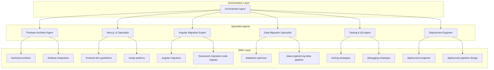
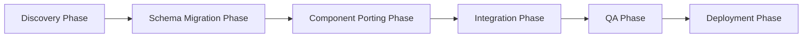
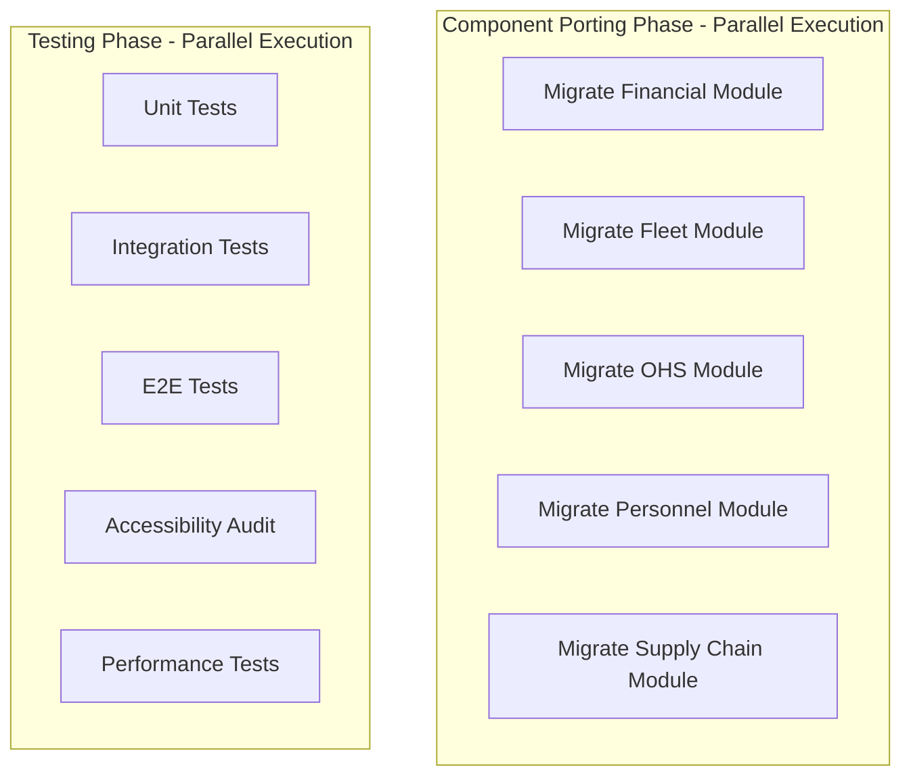
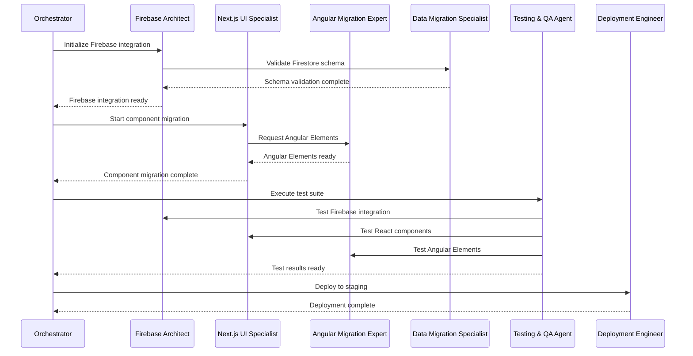

# Agent Orchestration Strategy

## Document Overview

**Strategy Date:** February 1, 2026  
**Approach:** Multi-Agent Squad with Skill-First Architecture  
**Orchestration Pattern:** Sequential with Parallel Execution Where Possible

---

## 1. Agent Squad Overview

### 1.1 Squad Composition

### 1.2 Agent Responsibilities Matrix

| Agent | Primary Responsibilities | Secondary Responsibilities |
|--------|----------------------|--------------------------|
| **Firebase Architect Agent** | Firebase integration, security rules, Cloud Functions | Data model validation, performance optimization |
| **Next.js UI Specialist** | Component migration, React hooks, state management | UI/UX implementation, accessibility |
| **Angular Migration Expert** | Angular Elements creation, legacy code analysis | Component wrapping, interop layer |
| **Data Migration Specialist** | Firestore schema validation, data integrity | Migration scripts, rollback procedures |
| **Testing & QA Agent** | Test automation, E2E testing, validation | Performance testing, accessibility audit |
| **Deployment Engineer** | CI/CD pipeline, deployment strategy, monitoring | Infrastructure setup, rollback automation |

---

## 2. Agent Definitions

### 2.1 Firebase Architect Agent

**Role:** Backend & Firebase Integration Specialist

**Primary Responsibilities:**
1. Design Firebase integration architecture for Next.js
2. Implement Firebase Authentication with OIDC (Microsoft Entra ID)
3. Define and implement Firestore security rules
4. Create Cloud Functions for server-side logic
5. Optimize Firestore queries and indexes
6. Implement real-time subscriptions where needed

**Skill Utilization:**
- **backend-architect** - API design, service boundaries, resilience patterns
- **auth-implementation-patterns** - OAuth2, JWT, RBAC implementation
- **database-optimizer** - Query optimization, indexing strategies

**Key Deliverables:**
- Firebase client initialization code
- Authentication flow implementation
- Firestore security rules
- Cloud Functions for file processing
- Performance optimization recommendations

**Handoff Protocols:**
- **To Next.js UI Specialist:** Firebase client SDK, authentication hooks
- **To Data Migration Specialist:** Firestore schema, security rules
- **To Deployment Engineer:** Firebase configuration, environment variables

---

### 2.2 Next.js UI Specialist

**Role:** Frontend Component Migration & React Expert

**Primary Responsibilities:**
1. Migrate Angular components to React/Next.js
2. Implement React hooks for state management
3. Create reusable UI components (shadcn/ui)
4. Implement responsive design (mobile-first)
5. Optimize performance (code splitting, lazy loading)
6. Ensure accessibility (WCAG 2.1 AA)

**Skill Utilization:**
- **frontend-dev-guidelines** - React best practices, Suspense-first data fetching
- **frontend-design** - UI/UX patterns, component design
- **accessibility-compliance-accessibility-audit** - WCAG compliance, ARIA roles

**Key Deliverables:**
- Migrated React components for all modules
- Custom React hooks (useAuth, useFirestore, useReports)
- Reusable UI component library
- Responsive layouts for all pages
- Accessibility audit report

**Handoff Protocols:**
- **To Testing & QA Agent:** Component specifications, test requirements
- **To Angular Migration Expert:** Components to wrap as Angular Elements
- **To Deployment Engineer:** Build configuration, optimization settings

---

### 2.3 Angular Migration Expert

**Role:** Angular Elements & Legacy Code Specialist

**Primary Responsibilities:**
1. Analyze existing Angular codebase
2. Identify components suitable for Angular Elements
3. Create Angular Elements from complex admin modules
4. Implement interop layer between React and Angular
5. Migrate Angular services to React hooks
6. Document migration patterns and best practices

**Skill Utilization:**
- **angular-migration** - Angular to React migration patterns
- **framework-migration-code-migrate** - Code transformation strategies
- **legacy-modernizer** - Gradual modernization approach

**Key Deliverables:**
- Angular Elements for admin modules
- React wrappers for Angular Elements
- Migration guide for remaining Angular code
- Interop layer documentation
- Deprecated Angular code list

**Handoff Protocols:**
- **To Next.js UI Specialist:** Angular Elements bundles, integration guide
- **To Data Migration Specialist:** Service migration requirements
- **To Testing & QA Agent:** Angular Elements test specifications

---

### 2.4 Data Migration Specialist

**Role:** Firestore & Data Integrity Specialist

**Primary Responsibilities:**
1. Validate Firestore schema compatibility
2. Create data migration scripts (if needed)
3. Implement data integrity checks
4. Design rollback procedures for data changes
5. Optimize Firestore queries and indexes
6. Document data model changes

**Skill Utilization:**
- **database-optimizer** - Query optimization, indexing
- **data-engineering-data-pipeline** - Data transformation, validation
- **backend-architect** - Data contracts, API design

**Key Deliverables:**
- Firestore schema validation report
- Data migration scripts (if needed)
- Data integrity check suite
- Rollback procedures documentation
- Query optimization recommendations

**Handoff Protocols:**
- **To Firebase Architect Agent:** Schema changes, optimization requirements
- **To Testing & QA Agent:** Data validation test cases
- **To Deployment Engineer:** Migration scripts, rollback procedures

---

### 2.5 Testing & QA Agent

**Role:** Test Automation & Quality Assurance Specialist

**Primary Responsibilities:**
1. Design comprehensive test strategy
2. Implement unit tests for all components
3. Create integration tests for API routes
4. Develop E2E tests for critical workflows
5. Perform accessibility audit
6. Execute performance testing

**Skill Utilization:**
- **testing-strategies** - Test design, automation patterns
- **debugging-strategies** - Error diagnosis, test failure analysis
- **accessibility-compliance-accessibility-audit** - WCAG compliance testing

**Key Deliverables:**
- Test strategy document
- Unit test suite (Jest + React Testing Library)
- Integration test suite (API routes)
- E2E test suite (Playwright)
- Accessibility audit report
- Performance test results

**Handoff Protocols:**
- **To All Agents:** Test results, bug reports, recommendations
- **To Deployment Engineer:** Test automation in CI/CD pipeline

---

### 2.6 Deployment Engineer

**Role:** CI/CD & Deployment Automation Specialist

**Primary Responsibilities:**
1. Design multi-stage CI/CD pipeline
2. Implement automated testing in pipeline
3. Configure deployment environments (dev, staging, prod)
4. Set up monitoring and alerting
5. Implement rollback procedures
6. Document deployment processes

**Skill Utilization:**
- **deployment-engineer** - CI/CD design, GitOps workflows
- **deployment-pipeline-design** - Multi-stage pipelines, approval gates
- **cloud-architect** - Infrastructure as code, environment management

**Key Deliverables:**
- CI/CD pipeline configuration (GitHub Actions)
- Environment configuration (dev, staging, prod)
- Monitoring and alerting setup
- Rollback automation scripts
- Deployment documentation and runbooks

**Handoff Protocols:**
- **To All Agents:** Deployment status, environment access
- **To Orchestrator Agent:** Deployment metrics, incident reports

---

## 3. Skill-First Task Mapping

### 3.1 Discovery Phase Tasks

| Task | Primary Agent | Primary Skill | Secondary Skills |
|------|---------------|----------------|------------------|
| Analyze current codebase | Angular Migration Expert | angular-migration | legacy-modernizer |
| Review Firebase configuration | Firebase Architect Agent | backend-architect | database-optimizer |
| Identify migration hotspots | Angular Migration Expert | framework-migration-code-migrate | debugging-strategies |
| Define data model requirements | Data Migration Specialist | data-engineering-data-pipeline | database-optimizer |
| Create performance baseline | Testing & QA Agent | testing-strategies | application-performance-performance-optimization |

### 3.2 Schema Migration Phase Tasks

| Task | Primary Agent | Primary Skill | Secondary Skills |
|------|---------------|----------------|------------------|
| Validate Firestore schema | Data Migration Specialist | database-optimizer | backend-architect |
| Create migration scripts | Data Migration Specialist | data-engineering-data-pipeline | deployment-engineer |
| Implement rollback procedures | Data Migration Specialist | deployment-pipeline-design | backend-architect |
| Test data integrity | Testing & QA Agent | testing-strategies | debugging-strategies |
| Update security rules | Firebase Architect Agent | auth-implementation-patterns | backend-architect |

### 3.3 Component Porting Phase Tasks

| Task | Primary Agent | Primary Skill | Secondary Skills |
|------|---------------|----------------|------------------|
| Migrate shared components | Next.js UI Specialist | frontend-dev-guidelines | frontend-design |
| Migrate upload component | Next.js UI Specialist | frontend-dev-guidelines | accessibility-compliance-accessibility-audit |
| Migrate dashboard | Next.js UI Specialist | frontend-dev-guidelines | frontend-design |
| Migrate financial module | Next.js UI Specialist | frontend-dev-guidelines | frontend-design |
| Migrate fleet module | Next.js UI Specialist | frontend-dev-guidelines | frontend-design |
| Migrate OHS module | Next.js UI Specialist | frontend-dev-guidelines | accessibility-compliance-accessibility-audit |
| Migrate personnel module | Next.js UI Specialist | frontend-dev-guidelines | frontend-design |
| Migrate supply chain module | Next.js UI Specialist | frontend-dev-guidelines | frontend-design |
| Create Angular Elements | Angular Migration Expert | angular-migration | framework-migration-code-migrate |
| Implement React wrappers | Angular Migration Expert | framework-migration-code-migrate | frontend-dev-guidelines |

### 3.4 Integration Phase Tasks

| Task | Primary Agent | Primary Skill | Secondary Skills |
|------|---------------|----------------|------------------|
| Implement Firebase Auth | Firebase Architect Agent | auth-implementation-patterns | backend-architect |
| Create Firestore client | Firebase Architect Agent | backend-architect | database-optimizer |
| Implement API routes | Firebase Architect Agent | backend-architect | api-design-principles |
| Integrate Angular Elements | Angular Migration Expert | angular-migration | framework-migration-code-migrate |
| Implement state management | Next.js UI Specialist | frontend-dev-guidelines | backend-architect |
| Add error handling | Next.js UI Specialist | error-handling-patterns | debugging-strategies |

### 3.5 QA Phase Tasks

| Task | Primary Agent | Primary Skill | Secondary Skills |
|------|---------------|----------------|------------------|
| Write unit tests | Testing & QA Agent | testing-strategies | debugging-strategies |
| Write integration tests | Testing & QA Agent | testing-strategies | api-testing-observability-api-mock |
| Write E2E tests | Testing & QA Agent | testing-strategies | debugging-strategies |
| Perform accessibility audit | Testing & QA Agent | accessibility-compliance-accessibility-audit | frontend-dev-guidelines |
| Execute performance tests | Testing & QA Agent | application-performance-performance-optimization | testing-strategies |
| Fix identified issues | All Agents | Various | Various |

### 3.6 Deployment Phase Tasks

| Task | Primary Agent | Primary Skill | Secondary Skills |
|------|---------------|----------------|------------------|
| Design CI/CD pipeline | Deployment Engineer | deployment-pipeline-design | deployment-engineer |
| Configure environments | Deployment Engineer | deployment-engineer | cloud-architect |
| Set up monitoring | Deployment Engineer | deployment-engineer | observability-logging |
| Implement rollback | Deployment Engineer | deployment-pipeline-design | deployment-engineer |
| Deploy to staging | Deployment Engineer | deployment-engineer | deployment-pipeline-design |
| Deploy to production | Deployment Engineer | deployment-engineer | deployment-pipeline-design |

---

## 4. Orchestration Workflow

### 4.1 Sequential Workflow

### 4.2 Parallel Execution Opportunities

### 4.3 Agent Coordination Flow

---

## 5. Handoff Protocols

### 5.1 Handoff Template

Each handoff must include:

1. **Deliverables:** What was completed
2. **Artifacts:** Files, code, documentation
3. **Dependencies:** What the next agent needs
4. **Known Issues:** Any problems or limitations
5. **Testing Status:** What has been tested
6. **Next Steps:** What the receiving agent should do

### 5.2 Firebase Architect → Next.js UI Specialist

**Deliverables:**
- Firebase client initialization code (`lib/firebase/client.ts`)
- Authentication hooks (`lib/hooks/useAuth.ts`)
- Firestore hooks (`lib/hooks/useFirestore.ts`)
- Storage hooks (`lib/hooks/useStorage.ts`)

**Artifacts:**
- TypeScript type definitions for Firebase
- Environment variable documentation
- Authentication flow diagram

**Dependencies:**
- Next.js project structure
- React component requirements

**Known Issues:**
- None expected

**Testing Status:**
- Unit tests for all hooks
- Integration tests for authentication flow

**Next Steps:**
- Integrate hooks into React components
- Implement authentication in layout
- Test Firebase integration in components

---

### 5.3 Next.js UI Specialist → Angular Migration Expert

**Deliverables:**
- List of components suitable for Angular Elements
- Component interface specifications
- React wrapper templates

**Artifacts:**
- Component documentation
- Props interface definitions
- Event handler specifications

**Dependencies:**
- Existing Angular codebase
- Angular Elements build configuration

**Known Issues:**
- Complex state management in some components
- Heavy dependencies on Angular services

**Testing Status:**
- Components tested in isolation
- Integration tests with React

**Next Steps:**
- Create Angular Elements from identified components
- Implement React wrappers
- Test interop layer

---

### 5.4 Angular Migration Expert → Testing & QA Agent

**Deliverables:**
- Angular Elements bundles
- React wrapper components
- Integration documentation

**Artifacts:**
- Bundled JavaScript files
- TypeScript definitions
- Usage examples

**Dependencies:**
- Test framework setup
- E2E test configuration

**Known Issues:**
- Some Angular Elements may have performance issues
- Event handling differences between Angular and React

**Testing Status:**
- Angular Elements tested in isolation
- React wrappers tested with sample data

**Next Steps:**
- Write unit tests for Angular Elements
- Write integration tests for React wrappers
- Test interop layer

---

### 5.5 All Agents → Deployment Engineer

**Deliverables:**
- Complete application code
- Test suite
- Configuration files

**Artifacts:**
- Source code repository
- Test results
- Documentation

**Dependencies:**
- CI/CD platform access
- Environment credentials

**Known Issues:**
- None expected

**Testing Status:**
- All tests passing
- Performance benchmarks met

**Next Steps:**
- Set up CI/CD pipeline
- Configure deployment environments
- Deploy to staging

---

## 6. Communication Protocol

### 6.1 Daily Standup

**Time:** 09:00 UTC  
**Duration:** 15 minutes  
**Participants:** All agents + Orchestrator

**Agenda:**
1. What did you accomplish yesterday?
2. What will you work on today?
3. Any blockers or dependencies?

### 6.2 Weekly Review

**Time:** Friday 15:00 UTC  
**Duration:** 60 minutes  
**Participants:** All agents + Orchestrator + Stakeholders

**Agenda:**
1. Progress review against milestones
2. Demo of completed features
3. Risk assessment and mitigation
4. Plan for next week

### 6.3 Ad-Hoc Communication

**Channel:** Slack / Discord  
**Response Time:** Within 2 hours during business hours

**Use Cases:**
- Blockers or dependencies
- Critical bugs or issues
- Questions about handoffs
- Emergency situations

---

## 7. Quality Gates

### 7.1 Phase Completion Criteria

**Discovery Phase:**
- ✅ Current architecture documented
- ✅ Migration hotspots identified
- ✅ Performance baseline established
- ✅ Skill mapping complete

**Schema Migration Phase:**
- ✅ Firestore schema validated
- ✅ Migration scripts created and tested
- ✅ Rollback procedures documented
- ✅ Data integrity verified

**Component Porting Phase:**
- ✅ All components migrated to React
- ✅ Angular Elements created for admin modules
- ✅ All components tested
- ✅ Accessibility audit passed

**Integration Phase:**
- ✅ Firebase integration complete
- ✅ API routes implemented
- ✅ State management working
- ✅ Error handling in place

**QA Phase:**
- ✅ Unit tests passing (100% coverage goal)
- ✅ Integration tests passing
- ✅ E2E tests passing
- ✅ Accessibility audit passed (WCAG 2.1 AA)
- ✅ Performance benchmarks met

**Deployment Phase:**
- ✅ CI/CD pipeline working
- ✅ Staging deployment successful
- ✅ Monitoring and alerting active
- ✅ Rollback procedures tested
- ✅ Production deployment successful

### 7.2 Go/No-Go Decision Points

**Before Each Phase:**
- Previous phase quality gates met?
- All blockers resolved?
- Stakeholder approval received?
- Risk assessment acceptable?

---

## 8. Risk Management

### 8.1 Agent-Specific Risks

| Agent | Risk | Mitigation |
|--------|-------|------------|
| Firebase Architect | Firebase SDK changes | Use stable versions, monitor release notes |
| Next.js UI Specialist | Component complexity | Break down into smaller components, use patterns |
| Angular Migration Expert | Angular Elements limitations | Test early, have fallback plan |
| Data Migration Specialist | Data loss | Comprehensive testing, rollback procedures |
| Testing & QA Agent | Insufficient test coverage | Set coverage targets, continuous testing |
| Deployment Engineer | Deployment failures | Staging environment, rollback automation |

### 8.2 Cross-Agent Risks

| Risk | Impact | Mitigation |
|-------|---------|------------|
| Handoff failures | Delays | Clear handoff protocols, documentation |
| Skill gaps | Quality issues | Training, knowledge sharing |
| Communication breakdown | Misalignment | Daily standups, clear documentation |
| Dependency conflicts | Integration issues | Early integration testing, dependency management |

---

## 9. Success Metrics

### 9.1 Agent Performance Metrics

| Metric | Target | Measurement |
|--------|---------|--------------|
| Task completion rate | 95%+ | Tasks completed / Tasks assigned |
| Handoff success rate | 100% | Successful handoffs / Total handoffs |
| Bug rate | <5% | Bugs found / Total deliverables |
| On-time delivery | 90%+ | Tasks on time / Total tasks |

### 9.2 Project Success Metrics

| Metric | Target | Measurement |
|--------|---------|--------------|
| Feature parity | 100% | Features migrated / Total features |
| Test coverage | 80%+ | Lines covered / Total lines |
| Performance improvement | 30%+ | (Old time - New time) / Old time |
| User satisfaction | 4.5/5 | User survey scores |

---

**Document Version:** 1.0  
**Last Updated:** February 1, 2026  
**Next Review:** Execution Roadmap
