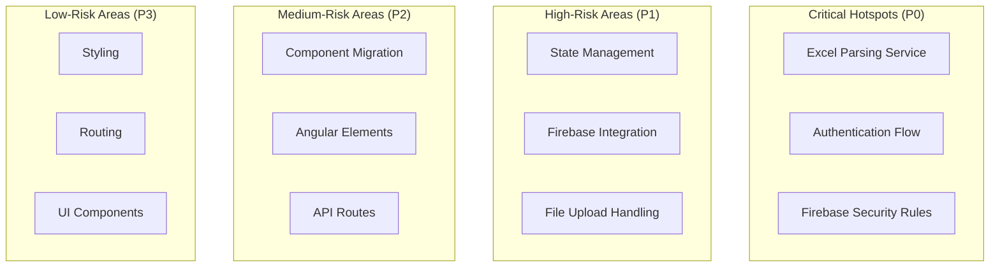

# Migration Hotspots & Risk Assessment

## Document Overview

**Assessment Date:** February 1, 2026  
**Total Hotspots Identified:** 12  
**Critical Hotspots:** 3  
**High-Risk Hotspots:** 5  
**Medium-Risk Hotspots:** 4

---

## 1. Hotspot Overview



### 1.1 Hotspot Summary

| Hotspot | Risk Level | Complexity | Impact | Priority |
|---------|------------|------------|--------|----------|
| Excel Parsing Service | 🔴 Critical | High | Business-critical | P0 |
| Authentication Flow | 🔴 Critical | High | Security-critical | P0 |
| Firebase Security Rules | 🔴 Critical | Medium | Security-critical | P0 |
| State Management | 🟠 High | High | User experience | P1 |
| Firestore Integration | 🟠 High | Medium | Data integrity | P1 |
| File Upload Handling | 🟠 High | Medium | User workflow | P1 |
| Component Migration | 🟡 Medium | Medium | Feature parity | P2 |
| Angular Elements | 🟡 Medium | Medium | Admin features | P2 |
| API Routes | 🟡 Medium | Low | Backend logic | P2 |
| Styling | 🟢 Low | Low | Visual consistency | P3 |
| Routing | 🟢 Low | Low | Navigation | P3 |
| UI Components | 🟢 Low | Low | User interface | P3 |

---

## 2. Critical Hotspots (P0)

### 2.1 Excel Parsing Service

**File:** [`src/app/services/excel-parsing.service.ts`](../src/app/services/excel-parsing.service.ts)

**Risk Level:** 🔴 Critical  
**Complexity:** High  
**Lines of Code:** ~1,500

#### 2.1.1 Why This Is a Hotspot

1. **Complex Cell Reference Mappings**
   - Precise cell addresses (e.g., I6 → reportDate, D7 → client)
   - Multiple template types (Progress Report, Stepped Discharge, Constant Discharge)
   - Nested data structures (shifts, activities, personnel)

2. **Business-Critical Logic**
   - Data validation rules are business-specific
   - Time calculations (night shift wrap-around)
   - Chargeable hours computation
   - Template detection and versioning

3. **Fragile Template Detection**
   - Heuristic-based template identification
   - Dependent on specific sheet names and cell patterns
   - No robust fallback for template variations

#### 2.1.2 Migration Challenges

| Challenge | Impact | Mitigation |
|-----------|--------|------------|
| Cell reference preservation | Data loss | Comprehensive testing with sample files |
| Template detection failures | Upload failures | Multiple detection strategies, error handling |
| Time format variations | Calculation errors | Robust parsing, validation |
| Large file handling | Performance issues | Streaming, chunking |
| Validation logic complexity | Business rule violations | Unit tests, integration tests |

#### 2.1.3 Migration Strategy

**Phase 1: Isolation (Week 2)**
```typescript
// Extract Excel parsing logic into standalone module
// lib/excel/parser.ts - Pure TypeScript, no framework dependencies
export class ExcelParser {
  parseProgressReport(file: File): Promise<Report> { }
  parseSteppedDischarge(file: File): Promise<DischargeTest> { }
  parseConstantDischarge(file: File): Promise<DischargeTest> { }
}
```

**Phase 2: Testing (Week 2-3)**
- Create comprehensive test suite with sample Excel files
- Test all template types
- Validate cell mappings
- Test edge cases (empty cells, invalid formats)

**Phase 3: Integration (Week 4)**
- Integrate with Next.js API routes
- Implement server-side validation
- Add error handling and logging

**Phase 4: Validation (Week 5)**
- Compare outputs with Angular version
- Validate data integrity
- Performance testing

#### 2.1.4 Success Criteria
- ✅ All template types parse correctly
- ✅ Cell mappings preserved exactly
- ✅ Validation rules working
- ✅ Error handling comprehensive
- ✅ Performance acceptable (< 5s for typical files)

#### 2.1.5 Rollback Plan

**Trigger:** Parsing failures or data integrity issues

**Procedure:**
1. Revert to Angular Excel parsing service
2. Use Angular Elements for upload functionality
3. Investigate and fix issues
4. Re-migrate when fixed

---

### 2.2 Authentication Flow

**Files:** [`src/app/services/auth.service.ts`](../src/app/services/auth.service.ts), Firebase Auth

**Risk Level:** 🔴 Critical  
**Complexity:** High  
**Lines of Code:** ~200

#### 2.2.1 Why This Is a Hotspot

1. **OIDC Integration with Microsoft Entra ID**
   - Complex OAuth2 flow
   - Token management and refresh
   - Session persistence

2. **Role-Based Access Control (RBAC)**
   - Multiple user roles (Site Manager, Office Manager, Admin)
   - Route protection
   - Permission checks

3. **SSR/Client Boundary**
   - Authentication state must work across SSR and client
   - Session management in Next.js
   - Middleware for route protection

#### 2.2.2 Migration Challenges

| Challenge | Impact | Mitigation |
|-----------|--------|------------|
| OIDC integration differences | Authentication failures | Use NextAuth.js, test thoroughly |
| Session persistence | Login issues | Proper cookie management |
| Route protection | Security vulnerabilities | Middleware implementation |
| Token refresh | Session expiration | Automatic token refresh |
| Role-based access | Unauthorized access | Comprehensive testing |

#### 2.2.3 Migration Strategy

**Phase 1: NextAuth.js Setup (Week 3)**
```typescript
// lib/auth/nextauth.ts
import NextAuth from 'next-auth';
import { CredentialsProvider } from 'next-auth/providers/credentials';

export const { handlers, signIn, signOut, auth } = NextAuth({
  providers: [
    CredentialsProvider({
      // Firebase Auth integration
    }),
  ],
  callbacks: {
    async jwt({ token, user }) {
      // Add user role to token
    },
    async session({ session, token }) {
      // Add role to session
    },
  },
});
```

**Phase 2: Firebase Auth Integration (Week 3)**
```typescript
// lib/firebase/auth.ts
import { getAuth, signInWithEmailAndPassword } from 'firebase/auth';

export async function firebaseAuth(email: string, password: string) {
  const auth = getAuth();
  const userCredential = await signInWithEmailAndPassword(auth, email, password);
  return userCredential.user;
}
```

**Phase 3: Middleware Implementation (Week 3)**
```typescript
// middleware.ts
import { auth } from '@/lib/auth/nextauth';

export async function middleware(request: NextRequest) {
  const session = await auth();
  // Route protection logic
}
```

**Phase 4: Testing (Week 4)**
- Test login flow
- Test session persistence
- Test route protection
- Test role-based access

#### 2.2.4 Success Criteria
- ✅ OIDC integration working with Microsoft Entra ID
- ✅ Session persistence across SSR/client boundary
- ✅ Route protection working
- ✅ Role-based access control enforced
- ✅ Token refresh working

#### 2.2.5 Rollback Plan

**Trigger:** Authentication failures or security issues

**Procedure:**
1. Revert to Angular authentication
2. Use Angular Elements for authenticated pages
3. Investigate and fix issues
4. Re-migrate when fixed

---

### 2.3 Firebase Security Rules

**Files:** [`firestore.rules`](../firestore.rules), [`storage.rules`](../storage.rules)

**Risk Level:** 🔴 Critical  
**Complexity:** Medium  
**Lines of Code:** ~200

#### 2.3.1 Why This Is a Hotspot

1. **Data Access Control**
   - Organization-based isolation
   - Role-based permissions
   - Document-level security

2. **Complex Query Requirements**
   - Composite indexes
   - Filter conditions
   - Subcollection access

3. **Security Implications**
   - Data leaks if rules are too permissive
   - Access denied if rules are too restrictive
   - Performance impact of complex rules

#### 2.3.2 Migration Challenges

| Challenge | Impact | Mitigation |
|-----------|--------|------------|
| Rule syntax differences | Access denied | Test rules thoroughly |
| Index requirements | Query failures | Create required indexes |
| Performance issues | Slow queries | Optimize rules |
| Security vulnerabilities | Data leaks | Security audit |

#### 2.3.3 Migration Strategy

**Phase 1: Rule Review (Week 2)**
```javascript
// firestore.rules
rules_version = '2';
service cloud.firestore {
  match /databases/{database}/documents {
    // Organization-based isolation
    match /organizations/{orgId} {
      allow read, write: if request.auth != null && 
                          request.auth.token.orgId == orgId;
    }
    
    // Reports access
    match /reports/{reportId} {
      allow read: if request.auth != null && 
                   isOwner() || isOfficeManager();
      allow create: if request.auth != null && 
                     isSiteManager();
      allow update: if request.auth != null && 
                     isOfficeManager();
    }
  }
}
```

**Phase 2: Index Creation (Week 2)**
```json
// firestore.indexes.json
{
  "indexes": [
    {
      "collectionGroup": "reports",
      "queryScope": "COLLECTION",
      "fields": [
        { "fieldPath": "orgId", "order": "ASCENDING" },
        { "fieldPath": "reportDate", "order": "DESCENDING" }
      ]
    }
  ]
}
```

**Phase 3: Testing (Week 3)**
- Test all access patterns
- Test role-based permissions
- Test edge cases
- Performance testing

#### 2.3.4 Success Criteria
- ✅ All access patterns working
- ✅ Role-based permissions enforced
- ✅ No data leaks
- ✅ Performance acceptable
- ✅ Security audit passed

#### 2.3.5 Rollback Plan

**Trigger:** Security issues or access failures

**Procedure:**
1. Revert to previous rules
2. Investigate and fix issues
3. Test thoroughly
4. Re-deploy when fixed

---

## 3. High-Risk Hotspots (P1)

### 3.1 State Management

**Current State:** Angular services with RxJS  
**Target State:** Zustand + React Query

**Risk Level:** 🟠 High  
**Complexity:** High

#### 3.1.1 Why This Is a Hotspot

1. **Complex State Logic**
   - Multiple data sources (Firestore, local state)
   - Complex filtering and sorting
   - Real-time updates

2. **Framework Differences**
   - RxJS observables vs React state
   - Change detection differences
   - Hook-based state management

3. **Performance Implications**
   - Unnecessary re-renders
   - Memory leaks
   - Stale data

#### 3.1.2 Migration Strategy

**Phase 1: State Analysis (Week 3)**
- Identify all state in Angular app
- Map to Zustand stores
- Define React Query keys

**Phase 2: Implementation (Week 4)**
```typescript
// lib/store/useReportStore.ts
import { create } from 'zustand';

export const useReportStore = create((set) => ({
  reports: [],
  selectedReport: null,
  filters: {},
  setReports: (reports) => set({ reports }),
  setSelectedReport: (report) => set({ selectedReport: report }),
}));
```

**Phase 3: Integration (Week 5)**
- Integrate with React components
- Test state updates
- Optimize performance

---

### 3.2 Firestore Integration

**Current State:** Angular Fire SDK  
**Target State:** Firebase JS SDK

**Risk Level:** 🟠 High  
**Complexity:** Medium

#### 3.2.1 Why This Is a Hotspot

1. **SDK Differences**
   - Angular Fire vs Firebase JS
   - Observable-based vs Promise-based
   - Type definitions

2. **Query Complexity**
   - Composite queries
   - Real-time subscriptions
   - Pagination

3. **Data Consistency**
   - Timestamp handling
   - Data normalization
   - Error handling

#### 3.2.2 Migration Strategy

**Phase 1: Client Setup (Week 3)**
```typescript
// lib/firebase/client.ts
import { initializeApp, getApps } from 'firebase/app';
import { getAuth } from 'firebase/auth';
import { getFirestore } from 'firebase/firestore';

const app = !getApps().length ? initializeApp(firebaseConfig) : getApps()[0];
export const auth = getAuth(app);
export const db = getFirestore(app);
```

**Phase 2: Data Layer (Week 4)**
```typescript
// lib/firestore/reports.ts
import { collection, query, where, orderBy } from 'firebase/firestore';

export async function getReports(filters?: ReportFilters): Promise<Report[]> {
  const q = query(collection(db, 'reports'), orderBy('reportDate', 'desc'));
  // Apply filters
  const snapshot = await getDocs(q);
  return snapshot.docs.map(doc => ({ id: doc.id, ...doc.data() }));
}
```

---

### 3.3 File Upload Handling

**Current State:** Angular component with client-side upload  
**Target State:** Next.js API route with server-side processing

**Risk Level:** 🟠 High  
**Complexity:** Medium

#### 3.3.1 Why This Is a Hotspot

1. **Large File Handling**
   - 10MB file size limit
   - Upload progress tracking
   - Error handling

2. **Server-Side Processing**
   - Next.js API routes
   - Streaming uploads
   - Memory management

3. **Integration with Excel Parsing**
   - File parsing after upload
   - Validation
   - Error reporting

#### 3.3.2 Migration Strategy

**Phase 1: API Route Creation (Week 4)**
```typescript
// app/api/upload/route.ts
import { NextRequest, NextResponse } from 'next/server';
import { getStorage, ref, uploadBytes } from 'firebase/storage';

export async function POST(request: NextRequest) {
  const formData = await request.formData();
  const file = formData.get('file') as File;
  
  // Upload to Firebase Storage
  const storageRef = ref(storage, `uploads/${fileName}`);
  await uploadBytes(storageRef, arrayBuffer);
  
  // Parse Excel file
  const parsedData = await parseExcelFile(file);
  
  return NextResponse.json({ success: true, data: parsedData });
}
```

---

## 4. Medium-Risk Hotspots (P2)

### 4.1 Component Migration

**Risk Level:** 🟡 Medium  
**Complexity:** Medium

**Challenges:**
- Template syntax differences (Angular vs React)
- Directive vs hook patterns
- Lifecycle methods
- Event handling

**Mitigation:**
- Use component migration patterns
- Test each component in isolation
- Maintain feature parity

### 4.2 Angular Elements

**Risk Level:** 🟡 Medium  
**Complexity:** Medium

**Challenges:**
- Performance overhead
- Event handling differences
- State synchronization
- Bundle size

**Mitigation:**
- Lazy load Angular Elements
- Test performance early
- Have React fallback

### 4.3 API Routes

**Risk Level:** 🟡 Medium  
**Complexity:** Low

**Challenges:**
- Request/response handling
- Error handling
- Authentication
- Rate limiting

**Mitigation:**
- Follow Next.js best practices
- Comprehensive error handling
- Proper authentication checks

---

## 5. Low-Risk Hotspots (P3)

### 5.1 Styling

**Risk Level:** 🟢 Low  
**Complexity:** Low

**Approach:**
- Reuse Tailwind CSS
- Use shadcn/ui components
- Maintain visual consistency

### 5.2 Routing

**Risk Level:** 🟢 Low  
**Complexity:** Low

**Approach:**
- Use Next.js App Router
- Maintain route structure
- Implement middleware

### 5.3 UI Components

**Risk Level:** 🟢 Low  
**Complexity:** Low

**Approach:**
- Use shadcn/ui components
- Create reusable components
- Follow React best practices

---

## 6. Risk Mitigation Summary

| Hotspot | Risk Level | Mitigation Strategy | Timeline |
|---------|------------|-------------------|----------|
| Excel Parsing Service | 🔴 Critical | Isolation, comprehensive testing | Weeks 2-5 |
| Authentication Flow | 🔴 Critical | NextAuth.js, thorough testing | Weeks 3-4 |
| Firebase Security Rules | 🔴 Critical | Rule review, security audit | Weeks 2-3 |
| State Management | 🟠 High | Zustand, React Query | Weeks 3-5 |
| Firestore Integration | 🟠 High | Firebase JS SDK, testing | Weeks 3-4 |
| File Upload Handling | 🟠 High | API routes, streaming | Weeks 4-5 |
| Component Migration | 🟡 Medium | Migration patterns, testing | Weeks 5-8 |
| Angular Elements | 🟡 Medium | Lazy loading, performance testing | Week 9 |
| API Routes | 🟡 Medium | Best practices, error handling | Weeks 10-11 |
| Styling | 🟢 Low | Tailwind, shadcn/ui | Weeks 5-8 |
| Routing | 🟢 Low | Next.js App Router | Weeks 3-4 |
| UI Components | 🟢 Low | shadcn/ui, React patterns | Weeks 5-8 |

---

## 7. Contingency Plans

### 7.1 Critical Hotspot Contingencies

| Hotspot | Trigger | Contingency | Timeline |
|---------|---------|-------------|----------|
| Excel Parsing Service | Parsing failures | Use Angular Elements for upload | 1 day |
| Authentication Flow | Auth failures | Use Angular Elements for auth | 2 days |
| Firebase Security Rules | Security issues | Revert to previous rules | 1 day |

### 7.2 High-Risk Hotspot Contingencies

| Hotspot | Trigger | Contingency | Timeline |
|---------|---------|-------------|----------|
| State Management | State issues | Use React Context as fallback | 2 days |
| Firestore Integration | Query failures | Use Angular Firestore service | 2 days |
| File Upload Handling | Upload failures | Use Angular upload component | 1 day |

### 7.3 Medium-Risk Hotspot Contingencies

| Hotspot | Trigger | Contingency | Timeline |
|---------|---------|-------------|----------|
| Component Migration | Migration delays | Extend timeline by 1 week | 1 week |
| Angular Elements | Performance issues | Rebuild in React | 3 days |
| API Routes | API failures | Use Angular services | 2 days |

---

**Document Version:** 1.0  
**Last Updated:** February 1, 2026  
**Next Review:** Handoff Protocols
