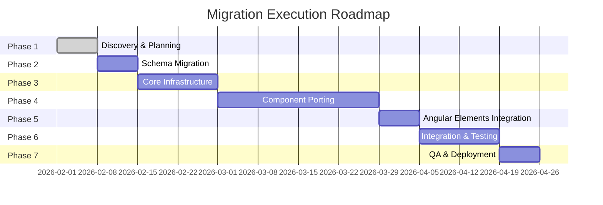

# Step-by-Step Execution Roadmap

## Document Overview

**Roadmap Date:** February 1, 2026  
**Total Duration:** 12 weeks  
**Approach:** Phased migration with quality gates

---

## 1. Phase Overview

---

## 2. Phase 1: Discovery & Planning (Week 1)

### 2.1 Objectives
- Analyze current codebase structure
- Identify migration hotspots and risks
- Create detailed task breakdown
- Establish performance baseline
- Set up development environment

### 2.2 Tasks

| Day | Task | Owner | Skill | Status |
|-----|------|-------|-------|--------|
| 1 | Analyze Angular codebase structure | Angular Migration Expert | angular-migration | Pending |
| 1 | Review Firebase configuration | Firebase Architect Agent | backend-architect | Pending |
| 2 | Identify migration hotspots | Angular Migration Expert | framework-migration-code-migrate | Pending |
| 2 | Create performance baseline | Testing & QA Agent | application-performance-performance-optimization | Pending |
| 3 | Define data model requirements | Data Migration Specialist | data-engineering-data-pipeline | Pending |
| 3 | Create task breakdown | Orchestrator | - | Pending |
| 4 | Set up Next.js project | Next.js UI Specialist | frontend-dev-guidelines | Pending |
| 4 | Configure Firebase SDK | Firebase Architect Agent | backend-architect | Pending |
| 5 | Review and approve plan | All Agents | - | Pending |

### 2.3 Deliverables
- ✅ Current architecture analysis document
- ✅ Migration hotspot identification
- ✅ Performance baseline metrics
- ✅ Detailed task breakdown
- ✅ Next.js project initialized
- ✅ Firebase SDK configured

### 2.4 Quality Gates
- ✅ All agents have reviewed current architecture
- ✅ Performance baseline documented
- ✅ Migration risks identified and mitigated
- ✅ Development environment set up and tested

---

## 3. Phase 2: Schema Migration (Week 2)

### 3.1 Objectives
- Validate Firestore schema compatibility
- Create data migration scripts (if needed)
- Implement rollback procedures
- Test data integrity

### 3.2 Tasks

| Day | Task | Owner | Skill | Status |
|-----|------|-------|-------|--------|
| 1 | Validate Firestore schema | Data Migration Specialist | database-optimizer | Pending |
| 1 | Document schema changes | Data Migration Specialist | backend-architect | Pending |
| 2 | Create migration scripts | Data Migration Specialist | data-engineering-data-pipeline | Pending |
| 2 | Test migration scripts | Data Migration Specialist | testing-strategies | Pending |
| 3 | Implement rollback procedures | Data Migration Specialist | deployment-pipeline-design | Pending |
| 3 | Document rollback procedures | Data Migration Specialist | deployment-engineer | Pending |
| 4 | Execute data integrity checks | Testing & QA Agent | testing-strategies | Pending |
| 4 | Verify data consistency | Testing & QA Agent | debugging-strategies | Pending |
| 5 | Update security rules | Firebase Architect Agent | auth-implementation-patterns | Pending |
| 5 | Review and approve schema | All Agents | - | Pending |

### 3.3 Deliverables
- ✅ Firestore schema validation report
- ✅ Data migration scripts (if needed)
- ✅ Rollback procedures documentation
- ✅ Data integrity check suite
- ✅ Updated security rules

### 3.4 Quality Gates
- ✅ Schema validated against requirements
- ✅ Migration scripts tested and verified
- ✅ Rollback procedures documented and tested
- ✅ Data integrity verified
- ✅ Security rules updated and tested

---

## 4. Phase 3: Core Infrastructure (Weeks 3-4)

### 4.1 Objectives
- Set up Next.js project structure
- Implement Firebase integration
- Create authentication flow
- Set up state management
- Configure routing

### 4.2 Tasks

| Day | Task | Owner | Skill | Status |
|-----|------|-------|-------|--------|
| 6 | Create Next.js app structure | Next.js UI Specialist | frontend-dev-guidelines | Pending |
| 6 | Set up routing | Next.js UI Specialist | frontend-dev-guidelines | Pending |
| 7 | Implement Firebase client | Firebase Architect Agent | backend-architect | Pending |
| 7 | Create authentication hooks | Firebase Architect Agent | auth-implementation-patterns | Pending |
| 8 | Implement NextAuth.js | Firebase Architect Agent | auth-implementation-patterns | Pending |
| 8 | Create Firestore hooks | Firebase Architect Agent | backend-architect | Pending |
| 9 | Set up state management | Next.js UI Specialist | frontend-dev-guidelines | Pending |
| 9 | Create global store | Next.js UI Specialist | backend-architect | Pending |
| 10 | Implement middleware | Next.js UI Specialist | frontend-dev-guidelines | Pending |
| 10 | Test authentication flow | Testing & QA Agent | testing-strategies | Pending |

### 4.3 Deliverables
- ✅ Next.js project structure
- ✅ Firebase client integration
- ✅ Authentication flow (OIDC with Microsoft Entra ID)
- ✅ Firestore data access layer
- ✅ State management (Zustand)
- ✅ Routing configuration
- ✅ Middleware for route protection

### 4.4 Quality Gates
- ✅ Next.js project builds successfully
- ✅ Firebase integration tested
- ✅ Authentication flow working
- ✅ Firestore queries working
- ✅ State management tested
- ✅ Routing and middleware tested

---

## 5. Phase 4: Component Porting (Weeks 5-8)

### 5.1 Objectives
- Migrate all Angular components to React
- Create reusable UI components
- Implement responsive design
- Ensure accessibility compliance
- Optimize performance

### 5.2 Tasks

| Week | Day | Task | Owner | Skill | Status |
|------|-----|------|-------|-------|--------|
| 5 | 11 | Migrate shared components | Next.js UI Specialist | frontend-dev-guidelines | Pending |
| 5 | 11 | Create UI component library | Next.js UI Specialist | frontend-design | Pending |
| 5 | 12 | Migrate upload component | Next.js UI Specialist | frontend-dev-guidelines | Pending |
| 5 | 12 | Implement file dropzone | Next.js UI Specialist | frontend-dev-guidelines | Pending |
| 5 | 13 | Migrate dashboard | Next.js UI Specialist | frontend-dev-guidelines | Pending |
| 5 | 13 | Create metrics cards | Next.js UI Specialist | frontend-design | Pending |
| 5 | 14 | Migrate reports list | Next.js UI Specialist | frontend-dev-guidelines | Pending |
| 5 | 14 | Implement filters | Next.js UI Specialist | frontend-design | Pending |
| 6 | 15 | Migrate financial module | Next.js UI Specialist | frontend-dev-guidelines | Pending |
| 6 | 15 | Create invoice components | Next.js UI Specialist | frontend-design | Pending |
| 6 | 16 | Migrate fleet module | Next.js UI Specialist | frontend-dev-guidelines | Pending |
| 6 | 16 | Create asset register | Next.js UI Specialist | frontend-design | Pending |
| 6 | 17 | Migrate OHS module | Next.js UI Specialist | frontend-dev-guidelines | Pending |
| 6 | 17 | Implement forms | Next.js UI Specialist | frontend-dev-guidelines | Pending |
| 6 | 18 | Migrate personnel module | Next.js UI Specialist | frontend-dev-guidelines | Pending |
| 6 | 18 | Create leave tracking | Next.js UI Specialist | frontend-design | Pending |
| 7 | 19 | Migrate supply chain module | Next.js UI Specialist | frontend-dev-guidelines | Pending |
| 7 | 19 | Create material master | Next.js UI Specialist | frontend-design | Pending |
| 7 | 20 | Implement responsive design | Next.js UI Specialist | frontend-dev-guidelines | Pending |
| 7 | 20 | Test mobile layouts | Testing & QA Agent | accessibility-compliance-accessibility-audit | Pending |
| 7 | 21 | Optimize performance | Next.js UI Specialist | application-performance-performance-optimization | Pending |
| 7 | 21 | Implement code splitting | Next.js UI Specialist | frontend-dev-guidelines | Pending |
| 8 | 22 | Accessibility audit | Testing & QA Agent | accessibility-compliance-accessibility-audit | Pending |
| 8 | 22 | Fix accessibility issues | Next.js UI Specialist | frontend-dev-guidelines | Pending |
| 8 | 23 | Component testing | Testing & QA Agent | testing-strategies | Pending |
| 8 | 23 | Fix test failures | Next.js UI Specialist | debugging-strategies | Pending |
| 8 | 24 | Review all components | All Agents | - | Pending |
| 8 | 24 | Approve component migration | All Agents | - | Pending |

### 5.3 Deliverables
- ✅ All Angular components migrated to React
- ✅ Reusable UI component library
- ✅ Responsive layouts for all pages
- ✅ Accessibility compliance (WCAG 2.1 AA)
- ✅ Performance optimizations
- ✅ Component test suite

### 5.4 Quality Gates
- ✅ All components migrated and tested
- ✅ Responsive design verified
- ✅ Accessibility audit passed
- ✅ Performance benchmarks met
- ✅ Test coverage > 80%

---

## 6. Phase 5: Angular Elements Integration (Week 9)

### 6.1 Objectives
- Identify components for Angular Elements
- Create Angular Elements from admin modules
- Implement React wrappers
- Test interop layer

### 6.2 Tasks

| Day | Task | Owner | Skill | Status |
|-----|------|-------|-------|--------|
| 25 | Identify Angular Elements candidates | Angular Migration Expert | angular-migration | Pending |
| 25 | Create Angular Elements build config | Angular Migration Expert | framework-migration-code-migrate | Pending |
| 26 | Create admin dashboard element | Angular Migration Expert | angular-migration | Pending |
| 26 | Create advanced reports element | Angular Migration Expert | angular-migration | Pending |
| 27 | Create data management element | Angular Migration Expert | angular-migration | Pending |
| 27 | Implement React wrappers | Angular Migration Expert | framework-migration-code-migrate | Pending |
| 28 | Test Angular Elements | Testing & QA Agent | testing-strategies | Pending |
| 28 | Test React wrappers | Testing & QA Agent | testing-strategies | Pending |
| 29 | Optimize Angular Elements | Angular Migration Expert | application-performance-performance-optimization | Pending |
| 29 | Document Angular Elements usage | Angular Migration Expert | docs-architect | Pending |

### 6.3 Deliverables
- ✅ Angular Elements for admin modules
- ✅ React wrappers for Angular Elements
- ✅ Interop layer documentation
- ✅ Angular Elements test suite

### 6.4 Quality Gates
- ✅ Angular Elements created and tested
- ✅ React wrappers working
- ✅ Interop layer tested
- ✅ Performance acceptable
- ✅ Documentation complete

---

## 7. Phase 6: Integration & Testing (Weeks 10-11)

### 7.1 Objectives
- Integrate all components
- Implement API routes
- Add error handling
- Execute comprehensive testing
- Fix identified issues

### 7.2 Tasks

| Week | Day | Task | Owner | Skill | Status |
|------|-----|------|-------|-------|--------|
| 10 | 30 | Implement API routes | Firebase Architect Agent | backend-architect | Pending |
| 10 | 30 | Create upload API | Firebase Architect Agent | api-design-principles | Pending |
| 10 | 31 | Create reports API | Firebase Architect Agent | api-design-principles | Pending |
| 10 | 31 | Implement error handling | Next.js UI Specialist | error-handling-patterns | Pending |
| 10 | 32 | Add loading states | Next.js UI Specialist | frontend-dev-guidelines | Pending |
| 10 | 32 | Implement error boundaries | Next.js UI Specialist | error-handling-patterns | Pending |
| 10 | 33 | Integration testing | Testing & QA Agent | testing-strategies | Pending |
| 10 | 33 | Test user workflows | Testing & QA Agent | testing-strategies | Pending |
| 11 | 34 | E2E testing | Testing & QA Agent | testing-strategies | Pending |
| 11 | 34 | Create test scenarios | Testing & QA Agent | testing-strategies | Pending |
| 11 | 35 | Performance testing | Testing & QA Agent | application-performance-performance-optimization | Pending |
| 11 | 35 | Optimize bottlenecks | Next.js UI Specialist | application-performance-performance-optimization | Pending |
| 11 | 36 | Fix integration issues | All Agents | debugging-strategies | Pending |
| 11 | 36 | Regression testing | Testing & QA Agent | testing-strategies | Pending |
| 11 | 37 | Final testing | Testing & QA Agent | testing-strategies | Pending |
| 11 | 37 | Approve for deployment | All Agents | - | Pending |

### 7.3 Deliverables
- ✅ API routes implemented
- ✅ Error handling in place
- ✅ Integration test suite
- ✅ E2E test suite
- ✅ Performance test results
- ✅ All issues resolved

### 7.4 Quality Gates
- ✅ All API routes working
- ✅ Error handling tested
- ✅ Integration tests passing
- ✅ E2E tests passing
- ✅ Performance benchmarks met
- ✅ No critical issues

---

## 8. Phase 7: QA & Deployment (Week 12)

### 8.1 Objectives
- Set up CI/CD pipeline
- Configure deployment environments
- Deploy to staging
- Execute final QA
- Deploy to production

### 8.2 Tasks

| Day | Task | Owner | Skill | Status |
|-----|------|-------|-------|--------|
| 38 | Design CI/CD pipeline | Deployment Engineer | deployment-pipeline-design | Pending |
| 38 | Configure GitHub Actions | Deployment Engineer | deployment-engineer | Pending |
| 39 | Set up staging environment | Deployment Engineer | deployment-engineer | Pending |
| 39 | Configure monitoring | Deployment Engineer | deployment-engineer | Pending |
| 40 | Deploy to staging | Deployment Engineer | deployment-engineer | Pending |
| 40 | Test staging deployment | Testing & QA Agent | testing-strategies | Pending |
| 41 | User acceptance testing | Testing & QA Agent | testing-strategies | Pending |
| 41 | Fix staging issues | All Agents | debugging-strategies | Pending |
| 42 | Set up production environment | Deployment Engineer | deployment-engineer | Pending |
| 42 | Configure production monitoring | Deployment Engineer | deployment-engineer | Pending |
| 43 | Deploy to production | Deployment Engineer | deployment-engineer | Pending |
| 43 | Verify production deployment | Testing & QA Agent | testing-strategies | Pending |
| 44 | Monitor production | Deployment Engineer | deployment-engineer | Pending |
| 44 | Create rollback plan | Deployment Engineer | deployment-pipeline-design | Pending |
| 45 | Final documentation | All Agents | docs-architect | Pending |
| 45 | Project handoff | All Agents | - | Pending |

### 8.3 Deliverables
- ✅ CI/CD pipeline configured
- ✅ Staging environment set up
- ✅ Production environment set up
- ✅ Monitoring and alerting active
- ✅ Staging deployment successful
- ✅ Production deployment successful
- ✅ Rollback procedures documented
- ✅ Final documentation complete

### 8.4 Quality Gates
- ✅ CI/CD pipeline working
- ✅ Staging deployment tested
- ✅ User acceptance testing passed
- ✅ Production deployment successful
- ✅ Monitoring active
- ✅ Rollback procedures tested
- ✅ Documentation complete

---

## 9. Milestones

### 9.1 Major Milestones

| Milestone | Date | Description | Success Criteria |
|-----------|------|-------------|------------------|
| M1 | Week 1 End | Discovery Complete | Architecture analyzed, baseline established |
| M2 | Week 2 End | Schema Migration Complete | Schema validated, migration scripts ready |
| M3 | Week 4 End | Infrastructure Ready | Firebase integrated, auth working |
| M4 | Week 8 End | Components Migrated | All components in React, tested |
| M5 | Week 9 End | Angular Elements Ready | Elements created, wrappers working |
| M6 | Week 11 End | Integration Complete | All features integrated, tested |
| M7 | Week 12 End | Production Live | Deployed to production, monitored |

### 9.2 Go/No-Go Decision Points

| Decision Point | Date | Criteria | Decision Maker |
|----------------|------|----------|----------------|
| D1 | Week 1 End | Discovery complete, risks identified | Orchestrator |
| D2 | Week 2 End | Schema validated, rollback ready | Data Migration Specialist |
| D3 | Week 4 End | Infrastructure tested, auth working | Firebase Architect Agent |
| D4 | Week 8 End | All components migrated, tested | Next.js UI Specialist |
| D5 | Week 9 End | Angular Elements working | Angular Migration Expert |
| D6 | Week 11 End | Integration complete, tests passing | Testing & QA Agent |
| D7 | Week 12 End | Staging tested, ready for production | Deployment Engineer |

---

## 10. Resource Allocation

### 10.1 Agent Effort Distribution

| Agent | Phase 1 | Phase 2 | Phase 3 | Phase 4 | Phase 5 | Phase 6 | Phase 7 | Total |
|--------|---------|---------|---------|---------|---------|---------|---------|-------|
| Firebase Architect Agent | 20% | 10% | 40% | 10% | 0% | 20% | 10% | 110% |
| Next.js UI Specialist | 10% | 0% | 30% | 50% | 0% | 20% | 10% | 120% |
| Angular Migration Expert | 30% | 0% | 0% | 10% | 50% | 10% | 0% | 100% |
| Data Migration Specialist | 10% | 60% | 0% | 0% | 0% | 10% | 0% | 80% |
| Testing & QA Agent | 10% | 10% | 10% | 20% | 20% | 40% | 30% | 140% |
| Deployment Engineer | 10% | 10% | 10% | 0% | 10% | 0% | 60% | 100% |
| Orchestrator | 10% | 10% | 10% | 10% | 20% | 0% | 10% | 70% |

### 10.2 Skill Utilization Summary

| Skill | Phase 1 | Phase 2 | Phase 3 | Phase 4 | Phase 5 | Phase 6 | Phase 7 |
|-------|---------|---------|---------|---------|---------|---------|---------|
| angular-migration | ✅ | - | - | - | ✅ | - | - |
| backend-architect | ✅ | ✅ | ✅ | - | - | ✅ | - |
| frontend-dev-guidelines | ✅ | - | ✅ | ✅ | - | ✅ | - |
| framework-migration-code-migrate | ✅ | - | - | - | ✅ | - | - |
| database-optimizer | - | ✅ | - | - | - | - | - |
| data-engineering-data-pipeline | ✅ | ✅ | - | - | - | - | - |
| auth-implementation-patterns | - | ✅ | ✅ | - | - | - | - |
| testing-strategies | ✅ | ✅ | ✅ | ✅ | ✅ | ✅ | ✅ |
| deployment-engineer | - | ✅ | - | - | - | - | ✅ |
| deployment-pipeline-design | - | ✅ | - | - | - | - | ✅ |
| accessibility-compliance-accessibility-audit | - | - | - | ✅ | - | - | - |
| application-performance-performance-optimization | ✅ | - | - | ✅ | ✅ | ✅ | - |
| error-handling-patterns | - | - | - | - | - | ✅ | - |
| api-design-principles | - | - | - | - | - | ✅ | - |
| debugging-strategies | - | - | - | ✅ | - | ✅ | - |
| docs-architect | - | - | - | - | ✅ | - | ✅ |

---

## 11. Risk Mitigation Timeline

### 11.1 High-Risk Periods

| Period | Risk | Mitigation | Owner |
|--------|-------|------------|-------|
| Week 2 | Data loss during migration | Comprehensive testing, rollback procedures | Data Migration Specialist |
| Week 4 | Authentication failures | Staging testing, fallback mechanisms | Firebase Architect Agent |
| Week 8 | Component integration issues | Early integration testing, parallel development | Next.js UI Specialist |
| Week 9 | Angular Elements performance | Performance testing, optimization | Angular Migration Expert |
| Week 11 | Integration failures | Comprehensive testing, issue tracking | Testing & QA Agent |
| Week 12 | Deployment failures | Staging validation, rollback automation | Deployment Engineer |

### 11.2 Contingency Plans

| Scenario | Trigger | Contingency | Timeline |
|----------|---------|-------------|----------|
| Schema migration fails | Data integrity check fails | Rollback to previous schema, investigate | 1 day |
| Authentication not working | OIDC integration fails | Use fallback auth, investigate | 2 days |
| Component migration delayed | Complex components identified | Extend Phase 4 by 1 week | 1 week |
| Angular Elements not performing | Performance benchmarks not met | Optimize or rebuild in React | 3 days |
| Integration issues found | E2E tests failing | Debug and fix, extend Phase 6 | 3 days |
| Deployment fails | Production deployment errors | Rollback, investigate, retry | 1 day |

---

## 12. Success Metrics

### 12.1 Phase-Level Metrics

| Phase | Metric | Target | Measurement |
|-------|--------|---------|--------------|
| Phase 1 | Tasks completed | 100% | Tasks completed / Total tasks |
| Phase 2 | Schema validation | 100% | Validated fields / Total fields |
| Phase 3 | Infrastructure tests | 100% | Tests passing / Total tests |
| Phase 4 | Component migration | 100% | Components migrated / Total components |
| Phase 5 | Angular Elements | 100% | Elements created / Total elements |
| Phase 6 | Integration tests | 100% | Tests passing / Total tests |
| Phase 7 | Deployment success | 100% | Successful deployments / Total deployments |

### 12.2 Project-Level Metrics

| Metric | Target | Measurement |
|--------|---------|--------------|
| Feature parity | 100% | Features migrated / Total features |
| Test coverage | 80%+ | Lines covered / Total lines |
| Performance improvement | 30%+ | (Old time - New time) / Old time |
| Accessibility compliance | 100% | WCAG 2.1 AA criteria met |
| User satisfaction | 4.5/5 | User survey scores |
| On-time delivery | 100% | Phases on time / Total phases |

---

**Document Version:** 1.0  
**Last Updated:** February 1, 2026  
**Next Review:** Migration Hotspots & Risks