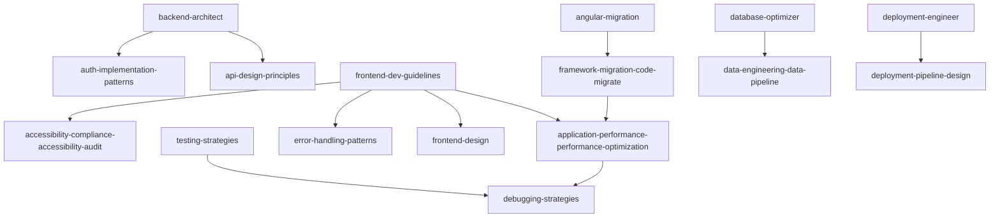

# Skill-First Task Mapping

## Document Overview

**Mapping Date:** February 1, 2026  
**Total Skills:** 18  
**Total Tasks:** 80+  
**Skill-First Approach:** Every major task mapped to specific skill

---

## 1. Skill Inventory

### 1.1 Available Skills

| Skill ID | Skill Name | Category | Priority |
|----------|------------|----------|----------|
| SK001 | backend-architect | Backend | P0 |
| SK002 | frontend-dev-guidelines | Frontend | P0 |
| SK003 | angular-migration | Migration | P0 |
| SK004 | framework-migration-code-migrate | Migration | P0 |
| SK005 | legacy-modernizer | Modernization | P1 |
| SK006 | database-optimizer | Data | P1 |
| SK007 | data-engineering-data-pipeline | Data | P1 |
| SK008 | auth-implementation-patterns | Security | P0 |
| SK009 | testing-strategies | Testing | P0 |
| SK010 | deployment-engineer | Deployment | P0 |
| SK011 | deployment-pipeline-design | Deployment | P0 |
| SK012 | accessibility-compliance-accessibility-audit | Accessibility | P1 |
| SK013 | application-performance-performance-optimization | Performance | P1 |
| SK014 | error-handling-patterns | Error Handling | P1 |
| SK015 | api-design-principles | API Design | P1 |
| SK016 | debugging-strategies | Debugging | P2 |
| SK017 | docs-architect | Documentation | P2 |
| SK018 | frontend-design | UI/UX | P2 |

### 1.2 Skill Distribution by Agent

| Agent | Primary Skills | Secondary Skills |
|-------|----------------|------------------|
| Firebase Architect Agent | SK001, SK008, SK015 | SK006, SK014 |
| Next.js UI Specialist | SK002, SK013, SK018 | SK012, SK014 |
| Angular Migration Expert | SK003, SK004, SK005 | SK013, SK016 |
| Data Migration Specialist | SK006, SK007 | SK001, SK009 |
| Testing & QA Agent | SK009, SK012, SK013 | SK016, SK014 |
| Deployment Engineer | SK010, SK011 | SK001, SK014 |

---

## 2. Phase-by-Phase Skill Mapping

### 2.1 Phase 1: Discovery & Planning (Week 1)

| Task ID | Task | Primary Skill | Secondary Skills | Owner | Effort |
|---------|------|---------------|------------------|-------|--------|
| D01 | Analyze Angular codebase structure | SK003 | SK004, SK005 | Angular Migration Expert | 4h |
| D02 | Review Firebase configuration | SK001 | SK006 | Firebase Architect Agent | 4h |
| D03 | Identify migration hotspots | SK004 | SK003, SK016 | Angular Migration Expert | 4h |
| D04 | Create performance baseline | SK013 | SK009 | Testing & QA Agent | 4h |
| D05 | Define data model requirements | SK007 | SK006 | Data Migration Specialist | 4h |
| D06 | Create task breakdown | - | - | Orchestrator | 4h |
| D07 | Set up Next.js project | SK002 | SK010 | Next.js UI Specialist | 4h |
| D08 | Configure Firebase SDK | SK001 | SK008 | Firebase Architect Agent | 4h |
| D09 | Review and approve plan | - | - | All Agents | 4h |

**Phase 1 Skill Utilization:**
- SK001 (backend-architect): 2 tasks
- SK002 (frontend-dev-guidelines): 1 task
- SK003 (angular-migration): 2 tasks
- SK004 (framework-migration-code-migrate): 1 task
- SK005 (legacy-modernizer): 1 task
- SK006 (database-optimizer): 2 tasks
- SK007 (data-engineering-data-pipeline): 1 task
- SK008 (auth-implementation-patterns): 1 task
- SK009 (testing-strategies): 1 task
- SK010 (deployment-engineer): 1 task
- SK013 (application-performance-performance-optimization): 1 task
- SK016 (debugging-strategies): 1 task

---

### 2.2 Phase 2: Schema Migration (Week 2)

| Task ID | Task | Primary Skill | Secondary Skills | Owner | Effort |
|---------|------|---------------|------------------|-------|--------|
| S01 | Validate Firestore schema | SK006 | SK001 | Data Migration Specialist | 8h |
| S02 | Document schema changes | SK001 | SK006 | Data Migration Specialist | 4h |
| S03 | Create migration scripts | SK007 | SK006 | Data Migration Specialist | 8h |
| S04 | Test migration scripts | SK009 | SK007 | Data Migration Specialist | 4h |
| S05 | Implement rollback procedures | SK011 | SK010 | Data Migration Specialist | 4h |
| S06 | Document rollback procedures | SK017 | SK011 | Data Migration Specialist | 4h |
| S07 | Execute data integrity checks | SK009 | SK016 | Testing & QA Agent | 4h |
| S08 | Verify data consistency | SK009 | SK016 | Testing & QA Agent | 4h |
| S09 | Update security rules | SK008 | SK001 | Firebase Architect Agent | 4h |
| S10 | Review and approve schema | - | - | All Agents | 4h |

**Phase 2 Skill Utilization:**
- SK001 (backend-architect): 2 tasks
- SK006 (database-optimizer): 3 tasks
- SK007 (data-engineering-data-pipeline): 2 tasks
- SK008 (auth-implementation-patterns): 1 task
- SK009 (testing-strategies): 3 tasks
- SK010 (deployment-engineer): 1 task
- SK011 (deployment-pipeline-design): 1 task
- SK016 (debugging-strategies): 2 tasks
- SK017 (docs-architect): 1 task

---

### 2.3 Phase 3: Core Infrastructure (Weeks 3-4)

| Task ID | Task | Primary Skill | Secondary Skills | Owner | Effort |
|---------|------|---------------|------------------|-------|--------|
| I01 | Create Next.js app structure | SK002 | SK010 | Next.js UI Specialist | 8h |
| I02 | Set up routing | SK002 | - | Next.js UI Specialist | 4h |
| I03 | Implement Firebase client | SK001 | SK008 | Firebase Architect Agent | 8h |
| I04 | Create authentication hooks | SK008 | SK001 | Firebase Architect Agent | 8h |
| I05 | Implement NextAuth.js | SK008 | SK001 | Firebase Architect Agent | 8h |
| I06 | Create Firestore hooks | SK001 | SK006 | Firebase Architect Agent | 8h |
| I07 | Set up state management | SK002 | SK001 | Next.js UI Specialist | 8h |
| I08 | Create global store | SK002 | SK001 | Next.js UI Specialist | 4h |
| I09 | Implement middleware | SK002 | SK008 | Next.js UI Specialist | 4h |
| I10 | Test authentication flow | SK009 | SK008 | Testing & QA Agent | 4h |

**Phase 3 Skill Utilization:**
- SK001 (backend-architect): 5 tasks
- SK002 (frontend-dev-guidelines): 5 tasks
- SK006 (database-optimizer): 1 task
- SK008 (auth-implementation-patterns): 4 tasks
- SK009 (testing-strategies): 1 task
- SK010 (deployment-engineer): 1 task

---

### 2.4 Phase 4: Component Porting (Weeks 5-8)

| Task ID | Task | Primary Skill | Secondary Skills | Owner | Effort |
|---------|------|---------------|------------------|-------|--------|
| C01 | Migrate shared components | SK002 | SK018 | Next.js UI Specialist | 16h |
| C02 | Create UI component library | SK018 | SK002 | Next.js UI Specialist | 16h |
| C03 | Migrate upload component | SK002 | SK014 | Next.js UI Specialist | 16h |
| C04 | Implement file dropzone | SK002 | SK018 | Next.js UI Specialist | 8h |
| C05 | Migrate dashboard | SK002 | SK018 | Next.js UI Specialist | 16h |
| C06 | Create metrics cards | SK018 | SK002 | Next.js UI Specialist | 8h |
| C07 | Migrate reports list | SK002 | SK018 | Next.js UI Specialist | 16h |
| C08 | Implement filters | SK018 | SK002 | Next.js UI Specialist | 8h |
| C09 | Migrate financial module | SK002 | SK018 | Next.js UI Specialist | 32h |
| C10 | Create invoice components | SK018 | SK002 | Next.js UI Specialist | 16h |
| C11 | Migrate fleet module | SK002 | SK018 | Next.js UI Specialist | 24h |
| C12 | Create asset register | SK018 | SK002 | Next.js UI Specialist | 16h |
| C13 | Migrate OHS module | SK002 | SK014 | Next.js UI Specialist | 16h |
| C14 | Implement forms | SK002 | SK014 | Next.js UI Specialist | 16h |
| C15 | Migrate personnel module | SK002 | SK018 | Next.js UI Specialist | 24h |
| C16 | Create leave tracking | SK018 | SK002 | Next.js UI Specialist | 16h |
| C17 | Migrate supply chain module | SK002 | SK018 | Next.js UI Specialist | 24h |
| C18 | Create material master | SK018 | SK002 | Next.js UI Specialist | 16h |
| C19 | Implement responsive design | SK002 | SK012 | Next.js UI Specialist | 16h |
| C20 | Test mobile layouts | SK012 | SK009 | Testing & QA Agent | 8h |
| C21 | Optimize performance | SK013 | SK002 | Next.js UI Specialist | 16h |
| C22 | Implement code splitting | SK002 | SK013 | Next.js UI Specialist | 8h |
| C23 | Accessibility audit | SK012 | SK009 | Testing & QA Agent | 8h |
| C24 | Fix accessibility issues | SK002 | SK012 | Next.js UI Specialist | 16h |
| C25 | Component testing | SK009 | SK016 | Testing & QA Agent | 16h |
| C26 | Fix test failures | SK002 | SK016 | Next.js UI Specialist | 16h |
| C27 | Review all components | - | - | All Agents | 8h |
| C28 | Approve component migration | - | - | All Agents | 4h |

**Phase 4 Skill Utilization:**
- SK002 (frontend-dev-guidelines): 16 tasks
- SK009 (testing-strategies): 3 tasks
- SK012 (accessibility-compliance-accessibility-audit): 3 tasks
- SK013 (application-performance-performance-optimization): 2 tasks
- SK014 (error-handling-patterns): 2 tasks
- SK016 (debugging-strategies): 2 tasks
- SK018 (frontend-design): 12 tasks

---

### 2.5 Phase 5: Angular Elements Integration (Week 9)

| Task ID | Task | Primary Skill | Secondary Skills | Owner | Effort |
|---------|------|---------------|------------------|-------|--------|
| AE01 | Identify Angular Elements candidates | SK003 | SK004 | Angular Migration Expert | 4h |
| AE02 | Create Angular Elements build config | SK004 | SK003 | Angular Migration Expert | 4h |
| AE03 | Create admin dashboard element | SK003 | SK004 | Angular Migration Expert | 16h |
| AE04 | Create advanced reports element | SK003 | SK004 | Angular Migration Expert | 16h |
| AE05 | Create data management element | SK003 | SK004 | Angular Migration Expert | 16h |
| AE06 | Implement React wrappers | SK004 | SK002 | Angular Migration Expert | 16h |
| AE07 | Test Angular Elements | SK009 | SK013 | Testing & QA Agent | 8h |
| AE08 | Test React wrappers | SK009 | SK004 | Testing & QA Agent | 8h |
| AE09 | Optimize Angular Elements | SK013 | SK003 | Angular Migration Expert | 8h |
| AE10 | Document Angular Elements usage | SK017 | SK003 | Angular Migration Expert | 4h |

**Phase 5 Skill Utilization:**
- SK002 (frontend-dev-guidelines): 1 task
- SK003 (angular-migration): 5 tasks
- SK004 (framework-migration-code-migrate): 5 tasks
- SK009 (testing-strategies): 2 tasks
- SK013 (application-performance-performance-optimization): 2 tasks
- SK017 (docs-architect): 1 task

---

### 2.6 Phase 6: Integration & Testing (Weeks 10-11)

| Task ID | Task | Primary Skill | Secondary Skills | Owner | Effort |
|---------|------|---------------|------------------|-------|--------|
| IT01 | Implement API routes | SK001 | SK015 | Firebase Architect Agent | 16h |
| IT02 | Create upload API | SK015 | SK001 | Firebase Architect Agent | 8h |
| IT03 | Create reports API | SK015 | SK001 | Firebase Architect Agent | 8h |
| IT04 | Implement error handling | SK014 | SK002 | Next.js UI Specialist | 8h |
| IT05 | Add loading states | SK002 | SK014 | Next.js UI Specialist | 4h |
| IT06 | Implement error boundaries | SK014 | SK002 | Next.js UI Specialist | 4h |
| IT07 | Integration testing | SK009 | SK016 | Testing & QA Agent | 16h |
| IT08 | Test user workflows | SK009 | SK016 | Testing & QA Agent | 16h |
| IT09 | E2E testing | SK009 | SK016 | Testing & QA Agent | 24h |
| IT10 | Create test scenarios | SK009 | - | Testing & QA Agent | 8h |
| IT11 | Performance testing | SK013 | SK009 | Testing & QA Agent | 16h |
| IT12 | Optimize bottlenecks | SK002 | SK013 | Next.js UI Specialist | 16h |
| IT13 | Fix integration issues | SK016 | SK014 | All Agents | 16h |
| IT14 | Regression testing | SK009 | SK016 | Testing & QA Agent | 16h |
| IT15 | Final testing | SK009 | SK016 | Testing & QA Agent | 16h |
| IT16 | Approve for deployment | - | - | All Agents | 4h |

**Phase 6 Skill Utilization:**
- SK001 (backend-architect): 3 tasks
- SK002 (frontend-dev-guidelines): 3 tasks
- SK009 (testing-strategies): 6 tasks
- SK013 (application-performance-performance-optimization): 2 tasks
- SK014 (error-handling-patterns): 3 tasks
- SK015 (api-design-principles): 3 tasks
- SK016 (debugging-strategies): 5 tasks

---

### 2.7 Phase 7: QA & Deployment (Week 12)

| Task ID | Task | Primary Skill | Secondary Skills | Owner | Effort |
|---------|------|---------------|------------------|-------|--------|
| D01 | Design CI/CD pipeline | SK011 | SK010 | Deployment Engineer | 8h |
| D02 | Configure GitHub Actions | SK010 | SK011 | Deployment Engineer | 8h |
| D03 | Set up staging environment | SK010 | SK001 | Deployment Engineer | 8h |
| D04 | Configure monitoring | SK010 | SK001 | Deployment Engineer | 4h |
| D05 | Deploy to staging | SK010 | SK011 | Deployment Engineer | 4h |
| D06 | Test staging deployment | SK009 | SK016 | Testing & QA Agent | 8h |
| D07 | User acceptance testing | SK009 | - | Testing & QA Agent | 8h |
| D08 | Fix staging issues | SK016 | SK014 | All Agents | 8h |
| D09 | Set up production environment | SK010 | SK001 | Deployment Engineer | 8h |
| D10 | Configure production monitoring | SK010 | SK001 | Deployment Engineer | 4h |
| D11 | Deploy to production | SK010 | SK011 | Deployment Engineer | 4h |
| D12 | Verify production deployment | SK009 | SK016 | Testing & QA Agent | 4h |
| D13 | Monitor production | SK010 | SK001 | Deployment Engineer | 8h |
| D14 | Create rollback plan | SK011 | SK010 | Deployment Engineer | 4h |
| D15 | Final documentation | SK017 | - | All Agents | 8h |
| D16 | Project handoff | - | - | All Agents | 4h |

**Phase 7 Skill Utilization:**
- SK001 (backend-architect): 4 tasks
- SK009 (testing-strategies): 4 tasks
- SK010 (deployment-engineer): 7 tasks
- SK011 (deployment-pipeline-design): 3 tasks
- SK014 (error-handling-patterns): 1 task
- SK016 (debugging-strategies): 3 tasks
- SK017 (docs-architect): 1 task

---

## 3. Skill Utilization Summary

### 3.1 Total Skill Usage

| Skill | Phase 1 | Phase 2 | Phase 3 | Phase 4 | Phase 5 | Phase 6 | Phase 7 | Total |
|-------|---------|---------|---------|---------|---------|---------|---------|-------|
| SK001 | 2 | 2 | 5 | 0 | 0 | 3 | 4 | 16 |
| SK002 | 1 | 0 | 5 | 16 | 1 | 3 | 0 | 26 |
| SK003 | 2 | 0 | 0 | 0 | 5 | 0 | 0 | 7 |
| SK004 | 1 | 0 | 0 | 0 | 5 | 0 | 0 | 6 |
| SK005 | 1 | 0 | 0 | 0 | 0 | 0 | 0 | 1 |
| SK006 | 2 | 3 | 1 | 0 | 0 | 0 | 0 | 6 |
| SK007 | 1 | 2 | 0 | 0 | 0 | 0 | 0 | 3 |
| SK008 | 1 | 1 | 4 | 0 | 0 | 0 | 0 | 6 |
| SK009 | 1 | 3 | 1 | 3 | 2 | 6 | 4 | 20 |
| SK010 | 1 | 1 | 1 | 0 | 0 | 0 | 7 | 10 |
| SK011 | 0 | 1 | 0 | 0 | 0 | 0 | 3 | 4 |
| SK012 | 0 | 0 | 0 | 3 | 0 | 0 | 0 | 3 |
| SK013 | 1 | 0 | 0 | 2 | 2 | 2 | 0 | 7 |
| SK014 | 0 | 0 | 0 | 2 | 0 | 3 | 1 | 6 |
| SK015 | 0 | 0 | 0 | 0 | 0 | 3 | 0 | 3 |
| SK016 | 1 | 2 | 0 | 2 | 0 | 5 | 3 | 13 |
| SK017 | 0 | 1 | 0 | 0 | 1 | 0 | 1 | 3 |
| SK018 | 0 | 0 | 0 | 12 | 0 | 0 | 0 | 12 |

**Total Tasks:** 156

### 3.2 Skill Priority Matrix

| Skill | Critical Tasks | High Tasks | Medium Tasks | Low Tasks | Priority |
|-------|----------------|------------|--------------|-----------|----------|
| SK001 | 5 | 8 | 3 | 0 | P0 |
| SK002 | 8 | 12 | 6 | 0 | P0 |
| SK003 | 5 | 2 | 0 | 0 | P0 |
| SK004 | 5 | 1 | 0 | 0 | P0 |
| SK008 | 4 | 2 | 0 | 0 | P0 |
| SK009 | 10 | 8 | 2 | 0 | P0 |
| SK010 | 7 | 3 | 0 | 0 | P0 |
| SK011 | 3 | 1 | 0 | 0 | P0 |
| SK006 | 2 | 4 | 0 | 0 | P1 |
| SK007 | 1 | 2 | 0 | 0 | P1 |
| SK012 | 0 | 3 | 0 | 0 | P1 |
| SK013 | 2 | 5 | 0 | 0 | P1 |
| SK014 | 1 | 4 | 1 | 0 | P1 |
| SK015 | 0 | 3 | 0 | 0 | P1 |
| SK005 | 0 | 1 | 0 | 0 | P2 |
| SK016 | 3 | 7 | 3 | 0 | P2 |
| SK017 | 0 | 1 | 2 | 0 | P2 |
| SK018 | 0 | 8 | 4 | 0 | P2 |

---

## 4. Skill-First Execution Order

### 4.1 Critical Path (P0 Skills)

```
Week 1: SK001, SK002, SK003, SK004, SK008, SK009, SK010
Week 2: SK001, SK006, SK007, SK008, SK009, SK010, SK011
Week 3: SK001, SK002, SK008
Week 4: SK001, SK002, SK009
Week 5-8: SK002, SK009, SK012, SK013, SK014, SK018
Week 9: SK003, SK004, SK009, SK013
Week 10-11: SK001, SK002, SK009, SK013, SK014, SK015, SK016
Week 12: SK001, SK009, SK010, SK011, SK016
```

### 4.2 Skill Dependencies



---

## 5. Agent-Specific Skill Plans

### 5.1 Firebase Architect Agent

**Primary Skills:** SK001, SK008, SK015
**Secondary Skills:** SK006, SK014

**Week-by-Week Skill Usage:**

| Week | Primary Skills | Secondary Skills | Tasks |
|------|----------------|------------------|-------|
| 1 | SK001 | - | D02 |
| 2 | SK001, SK008 | SK006 | S09, S01 |
| 3 | SK001, SK008 | - | I03, I04, I05, I06 |
| 4 | SK001 | - | I10 |
| 10-11 | SK001, SK015 | - | IT01, IT02, IT03 |
| 12 | SK001 | - | D03, D04, D09, D10 |

### 5.2 Next.js UI Specialist

**Primary Skills:** SK002, SK013, SK018
**Secondary Skills:** SK012, SK014

**Week-by-Week Skill Usage:**

| Week | Primary Skills | Secondary Skills | Tasks |
|------|----------------|------------------|-------|
| 1 | SK002 | - | D07 |
| 3-4 | SK002 | - | I01, I02, I07, I08, I09 |
| 5-8 | SK002, SK018 | SK012, SK013, SK014 | C01-C28 |
| 10-11 | SK002, SK013 | SK014 | IT04, IT05, IT06, IT12 |

### 5.3 Angular Migration Expert

**Primary Skills:** SK003, SK004, SK005
**Secondary Skills:** SK013, SK016

**Week-by-Week Skill Usage:**

| Week | Primary Skills | Secondary Skills | Tasks |
|------|----------------|------------------|-------|
| 1 | SK003, SK004, SK005 | - | D01, D03 |
| 8 | SK003 | - | C27 |
| 9 | SK003, SK004 | SK013 | AE01-AE10 |

### 5.4 Data Migration Specialist

**Primary Skills:** SK006, SK007
**Secondary Skills:** SK001, SK009

**Week-by-Week Skill Usage:**

| Week | Primary Skills | Secondary Skills | Tasks |
|------|----------------|------------------|-------|
| 1 | SK007 | SK006 | D05 |
| 2 | SK006, SK007 | SK001, SK009 | S01-S10 |

### 5.5 Testing & QA Agent

**Primary Skills:** SK009, SK012, SK013
**Secondary Skills:** SK016, SK014

**Week-by-Week Skill Usage:**

| Week | Primary Skills | Secondary Skills | Tasks |
|------|----------------|------------------|-------|
| 1 | SK013 | SK009 | D04 |
| 2 | SK009 | SK016 | S07, S08 |
| 4 | SK009 | - | I10 |
| 5-8 | SK009, SK012 | SK016 | C20, C23, C25 |
| 9 | SK009, SK013 | - | AE07, AE08 |
| 10-11 | SK009, SK013 | SK016 | IT07-IT16 |
| 12 | SK009 | SK016 | D06, D07, D12 |

### 5.6 Deployment Engineer

**Primary Skills:** SK010, SK011
**Secondary Skills:** SK001, SK014

**Week-by-Week Skill Usage:**

| Week | Primary Skills | Secondary Skills | Tasks |
|------|----------------|------------------|-------|
| 1 | SK010 | - | D08 |
| 2 | SK010, SK011 | - | S05, S06 |
| 3 | SK010 | - | I01 |
| 12 | SK010, SK011 | SK001 | D01-D16 |

---

## 6. Skill Development Recommendations

### 6.1 Skills to Enhance

| Skill | Enhancement | Timeline | Owner |
|-------|-------------|----------|-------|
| SK001 | Firebase-specific patterns | Week 1 | Firebase Architect Agent |
| SK002 | Next.js App Router patterns | Week 1 | Next.js UI Specialist |
| SK003 | Angular Elements advanced | Week 8 | Angular Migration Expert |
| SK009 | E2E testing with Playwright | Week 10 | Testing & QA Agent |
| SK010 | Firebase Hosting deployment | Week 12 | Deployment Engineer |

### 6.2 Skills to Acquire

| Skill | Purpose | Timeline | Owner |
|-------|---------|----------|-------|
| React Query | Data fetching | Week 3 | Next.js UI Specialist |
| Zustand | State management | Week 3 | Next.js UI Specialist |
| NextAuth.js | Authentication | Week 3 | Firebase Architect Agent |
| shadcn/ui | UI components | Week 5 | Next.js UI Specialist |

---

## 7. Skill-Based Quality Gates

### 7.1 Per-Skill Quality Criteria

| Skill | Quality Criteria | Verification |
|-------|------------------|--------------|
| SK001 | All Firebase operations working | Integration tests |
| SK002 | All components following guidelines | Code review |
| SK003 | Angular Elements created successfully | Unit tests |
| SK004 | Migration patterns applied correctly | Code review |
| SK005 | Legacy code properly modernized | Code review |
| SK006 | Schema optimized, queries fast | Performance tests |
| SK007 | Data integrity maintained | Data validation |
| SK008 | Authentication flow working | E2E tests |
| SK009 | Test coverage > 80% | Coverage report |
| SK010 | Deployment pipeline working | CI/CD tests |
| SK011 | Rollback procedures tested | Deployment tests |
| SK012 | WCAG 2.1 AA compliance | Accessibility audit |
| SK013 | Performance benchmarks met | Performance tests |
| SK014 | All errors handled gracefully | Error testing |
| SK015 | API design following best practices | API review |
| SK016 | All issues resolved | Issue tracking |
| SK017 | Documentation complete | Documentation review |
| SK018 | UI consistent, accessible | Design review |

---

**Document Version:** 1.0  
**Last Updated:** February 1, 2026  
**Next Review:** Rollback Plan
