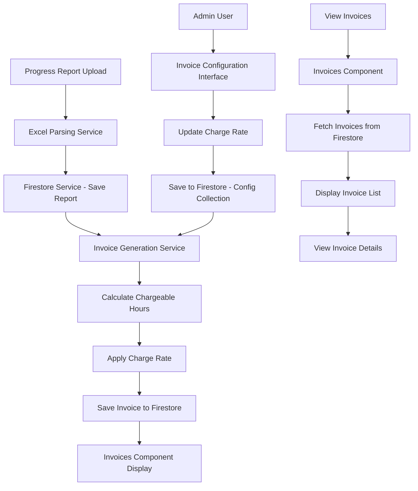

# Invoice Integration Plan

## Overview

This plan outlines the integration of progress reports with the invoicing system. When a progress report is uploaded, an invoice will be automatically generated based on chargeable activities. The system will track hours worked, apply configurable charge rates, and provide a comprehensive invoice management interface.

## Requirements Summary

1. **Automatic Invoice Generation**: Create an invoice for each progress report uploaded
2. **Hour Calculation**: Parse hours from format "H:MM" (e.g., "3:50" = 3 hours 50 minutes)
3. **Charge Rate Configuration**: Admin interface to set charge rate (default: $20/hour)
4. **Invoice Listing**: Display invoices with metadata (client+project/site, date)
5. **Detailed Breakdown**: Show activities, total hours, and amounts separated by day/night shifts

## System Architecture



## Data Models

### Invoice Interface

```typescript
export interface Invoice {
  invoiceId: string;
  reportId: string; // Reference to progress report
  orgId: string;
  projectId: string;
  siteId: string;
  
  // Metadata from progress report
  client: string;
  projectSiteArea: string;
  reportDate: Date;
  rigNumber: string;
  
  // Invoice details
  invoiceNumber: string; // Auto-generated (e.g., INV-2024-001)
  invoiceDate: Date;
  status: 'Draft' | 'Sent' | 'Paid' | 'Overdue';
  
  // Financial details
  chargeRate: number; // USD per hour
  totalAmount: number; // Total invoice amount
  
  // Shift breakdowns
  dayShift: InvoiceShift;
  nightShift: InvoiceShift;
  
  // Totals
  totalChargeableHours: number;
  
  // Audit
  createdBy: string;
  createdAt: Date;
  updatedAt: Date;
}

export interface InvoiceShift {
  totalHours: number;
  chargeableHours: number;
  activities: InvoiceActivity[];
  amount: number; // chargeableHours * chargeRate
}

export interface InvoiceActivity {
  order: number;
  activity: string;
  from: string; // HH:mm
  to: string; // HH:mm
  total: string; // H:MM format
  totalHours: number; // Decimal hours
  chargeable: boolean;
  amount: number; // totalHours * chargeRate (if chargeable)
}
```

### Invoice Configuration Interface

```typescript
export interface InvoiceConfig {
  configId: string;
  orgId: string;
  chargeRate: number; // USD per hour
  currency: string; // Default: 'USD'
  invoicePrefix: string; // Default: 'INV'
  nextInvoiceNumber: number; // For auto-incrementing
  taxRate?: number; // Optional tax rate percentage
  notes?: string; // Default invoice notes
  updatedAt: Date;
  updatedBy: string;
}
```

## Implementation Tasks

### Phase 1: Data Model & Service Layer

- [ ] Add Invoice, InvoiceShift, and InvoiceActivity interfaces to [`pumping-data.model.ts`](src/app/models/pumping-data.model.ts)
- [ ] Add InvoiceConfig interface to [`pumping-data.model.ts`](src/app/models/pumping-data.model.ts)
- [ ] Create [`invoice.service.ts`](src/app/services/invoice.service.ts) with methods:
  - `generateInvoiceFromReport(report: Report, chargeRate: number): Promise<Invoice>`
  - `saveInvoice(invoice: Invoice): Promise<void>`
  - `getInvoices(orgId?: string): Promise<Invoice[]>`
  - `getInvoice(invoiceId: string): Promise<Invoice | null>`
  - `updateInvoiceStatus(invoiceId: string, status: Invoice['status']): Promise<void>`
  - `parseHoursToDecimal(hoursString: string): number` - Parse "H:MM" to decimal hours
  - `calculateChargeableHours(shift: Shift): number`
  - `generateInvoiceNumber(prefix: string, nextNumber: number): string`

- [ ] Create [`invoice-config.service.ts`](src/app/services/invoice-config.service.ts) with methods:
  - `getConfig(orgId: string): Promise<InvoiceConfig>`
  - `saveConfig(config: InvoiceConfig): Promise<void>`
  - `getDefaultConfig(): InvoiceConfig` - Returns default config with $20/hour rate

- [ ] Update [`firestore.service.ts`](src/app/services/firestore.service.ts) with invoice methods:
  - `saveInvoice(invoice: Invoice): Promise<void>`
  - `getInvoices(orgId?: string): Promise<Invoice[]>`
  - `getInvoice(invoiceId: string): Promise<Invoice | null>`
  - `updateInvoice(invoiceId: string, data: Partial<Invoice>): Promise<void>`
  - `saveInvoiceConfig(config: InvoiceConfig): Promise<void>`
  - `getInvoiceConfig(orgId: string): Promise<InvoiceConfig | null>`

### Phase 2: Invoice Generation Integration

- [ ] Update [`upload.component.ts`](src/app/components/upload/upload.component.ts) to trigger invoice generation after report save:
  - After `saveReport()` succeeds, call invoice generation service
  - Handle invoice generation errors gracefully
  - Show success message with invoice reference

- [ ] Implement automatic invoice generation logic in [`invoice.service.ts`](src/app/services/invoice.service.ts):
  - Parse day shift activities for chargeable hours
  - Parse night shift activities for chargeable hours
  - Calculate amounts based on charge rate
  - Generate unique invoice number
  - Create invoice with all metadata from report

### Phase 3: Invoices Component

- [ ] Create [`invoices.component.html`](src/app/modules/financial/invoices/invoices.component.html) with:
  - Invoice list table showing: Invoice #, Date, Client, Project/Site, Total Hours, Amount, Status
  - Filter controls (by date range, client, status)
  - Search functionality
  - View details button for each invoice
  - Invoice detail modal/view showing:
    - Invoice header (invoice #, date, client, project/site)
    - Day shift breakdown (activities, hours, amounts)
    - Night shift breakdown (activities, hours, amounts)
    - Summary section (total hours, total amount, charge rate)
    - Status update controls (Draft → Sent → Paid)

- [ ] Update [`invoices.component.ts`](src/app/modules/financial/invoices/invoices.component.ts) with:
  - Load invoices on component init
  - Filter and search functionality
  - Invoice detail view logic
  - Status update functionality
  - Format currency and hours display

- [ ] Create [`invoices.component.scss`](src/app/modules/financial/invoices/invoices.component.scss) for styling

### Phase 4: Admin Configuration Interface

- [ ] Create [`invoice-config.component.ts`](src/app/modules/financial/invoice-config/invoice-config.component.ts) with:
  - Load current invoice config
  - Form to edit charge rate, currency, invoice prefix
  - Save config functionality
  - Admin role check (only Admin users can access)

- [ ] Create [`invoice-config.component.html`](src/app/modules/financial/invoice-config/invoice-config.component.html) with:
  - Form fields for charge rate, currency, invoice prefix
  - Save/Cancel buttons
  - Display current config values
  - Validation for charge rate (must be positive number)

- [ ] Create [`invoice-config.component.scss`](src/app/modules/financial/invoice-config/invoice-config.component.scss) for styling

- [ ] Create [`invoice-config.module.ts`](src/app/modules/financial/invoice-config/invoice-config.module.ts)

- [ ] Update [`financial.module.ts`](src/app/modules/financial/financial.module.ts) to add invoice config route

- [ ] Update [`financial.component.ts`](src/app/modules/financial/financial.component.ts) to add "Invoice Settings" link (admin only)

### Phase 5: Routing & Navigation

- [ ] Update [`financial.module.ts`](src/app/modules/financial/financial.module.ts) routes:
  - Add route for invoice config: `{ path: 'invoice-config', loadChildren: () => import('./invoice-config/invoice-config.module').then(m => m.InvoiceConfigModule) }`

- [ ] Add guard to invoice config route to restrict to Admin users only

### Phase 6: Testing & Validation

- [ ] Test invoice generation on progress report upload
- [ ] Verify hour parsing from "H:MM" format
- [ ] Test charge rate configuration
- [ ] Verify invoice calculations (hours × rate = amount)
- [ ] Test invoice listing and filtering
- [ ] Test invoice detail view
- [ ] Test status updates
- [ ] Test admin-only access to configuration

## Hour Parsing Logic

The system needs to parse hours from the format "H:MM" (e.g., "3:50") to decimal hours:

```typescript
parseHoursToDecimal(hoursString: string): number {
  if (!hoursString) return 0;
  
  const parts = hoursString.split(':');
  if (parts.length !== 2) return 0;
  
  const hours = parseInt(parts[0], 10) || 0;
  const minutes = parseInt(parts[1], 10) || 0;
  
  return hours + (minutes / 60);
}
```

Examples:
- "3:50" → 3 + 50/60 = 3.833 hours
- "1:30" → 1 + 30/60 = 1.5 hours
- "0:45" → 0 + 45/60 = 0.75 hours

## Invoice Calculation Example

Given a progress report with:
- Charge rate: $20/hour
- Day shift chargeable activities: 4.5 hours
- Night shift chargeable activities: 3.25 hours

Invoice calculation:
- Day shift amount: 4.5 × $20 = $90
- Night shift amount: 3.25 × $20 = $65
- Total chargeable hours: 7.75 hours
- Total invoice amount: $155

## Firestore Collections

### invoices Collection
```
invoices/
  {invoiceId}/
    invoiceId: string
    reportId: string
    orgId: string
    projectId: string
    siteId: string
    client: string
    projectSiteArea: string
    reportDate: Timestamp
    rigNumber: string
    invoiceNumber: string
    invoiceDate: Timestamp
    status: string
    chargeRate: number
    totalAmount: number
    dayShift: { ... }
    nightShift: { ... }
    totalChargeableHours: number
    createdBy: string
    createdAt: Timestamp
    updatedAt: Timestamp
```

### invoice-configs Collection
```
invoice-configs/
  {orgId}/
    configId: string
    orgId: string
    chargeRate: number
    currency: string
    invoicePrefix: string
    nextInvoiceNumber: number
    taxRate?: number
    notes?: string
    updatedAt: Timestamp
    updatedBy: string
```

## UI/UX Considerations

1. **Invoice List View**:
   - Clean table layout with sortable columns
   - Status badges with color coding (Draft=gray, Sent=blue, Paid=green, Overdue=red)
   - Quick filters for date range and status

2. **Invoice Detail View**:
   - Professional invoice layout
   - Clear separation of day/night shifts
   - Summary section prominently displayed
   - Print-friendly design

3. **Configuration Interface**:
   - Simple form with clear labels
   - Input validation
   - Save confirmation
   - Admin-only access indication

## Security Considerations

1. **Role-Based Access**:
   - Only Admin users can access invoice configuration
   - All users can view invoices
   - Only Admin/OM users can update invoice status

2. **Data Validation**:
   - Validate charge rate is positive number
   - Validate hours format before parsing
   - Prevent duplicate invoice generation for same report

## Future Enhancements

1. **PDF Generation**: Export invoices as PDF
2. **Email Integration**: Send invoices via email
3. **Multi-Currency Support**: Support different currencies per client
4. **Tax Calculation**: Include tax rates and calculations
5. **Payment Tracking**: Track partial payments
6. **Invoice Templates**: Customizable invoice templates
7. **Recurring Invoices**: Generate recurring invoices for ongoing projects
8. **Reporting**: Invoice analytics and financial reports
